# Tutorial: Quartus and ModelSim
by Eddie Hung with Mieszko Lis, Cristian Grecu, Guy Lemieux, and Steve Wilton

## Table of contents

* [Introduction](#introduction)
* [Installing Quartus and ModelSim](#installing-quartus-and-modelsim)
* [Simulating using ModelSim](#simulating-using-modelsim)
* [Synthesis with Quartus Prime](#synthesis-with-quartus-prime)
* [Programming the FPGA](#programming-the-fpga)
* [Post\-synthesis simulation](#post-synthesis-simulation)
* [GitHub submissions and autograding](#github-submissions-and-autograding)
* [Conclusion](#conclusion)

## Introduction

The purpose of this document is to very briefly describe how to use the Intel Quartus Prime and ModelSim software packages to design digital systems. It is targeted at students of CPEN 311 at the University of British Columbia.

A typical design flow may look like this:

First, the designer will describe their circuit using a Hardware Description Language (HDL) like Verilog. Next, the designer will simulate the Verilog to test the design, fix any bugs, and repeat until the design functions correctly. We will be using the industry-standard ModelSim simulator to perform this logic simulation stage.

The third stage is to compile the circuit, from the text-like Verilog description into a network of logic gates called a _netlist_ (this step is often called _synthesis_). The netlist can be used to program Field-Programmable Gate-Arrays (FPGAs), as we will be doing in this course, or to fabricate a custom ASIC chip.

We will be using another industry-standard tool, Intel Quartus Prime, to synthesize our Verilog into a format compatible with the Intel FPGAs we use in this course. Finally, we will program the FPGA chip with this output to actually realize the circuit in hardware on a development board. Instructions for the DE1-SoC board are included.

## Installing Quartus and ModelSim

You can choose from either Windows or Linux versions of the software. If you have a Mac, you can run will either Windows or Linux inside VirtualBox or a similar virtual machine environment.

You should install [Quartus Prime Lite](https://fpgasoftware.intel.com/19.1/?edition=lite) (it's free). You will want version **19.1**. Make sure your download includes the ModelSim simulator and support for the Cyclone V FPGA device that is the heart of your DE1-SoC / DE0-CV board, and that that you select all of these during installation.
The easy thing is to download the full 6GB file -- you'll need about 14GB of disk space available because another 8GB or more is needed to unpack/install/decompress during the installation.

If you need to save space, things get much more complicated. There is an "Individual Files" tab. Make sure that your download includes Quartus Prime (1.8GB), ModelSim (1GB) and support for the Cyclone V FPGA device (1.3GB). You don't need to compile for other FPGA devices. Note that the installation and setup of ModelSim might not go very smoothly using this method, so I strongly advise you to use the full install method if at all possible.

Optional: go to the "Additional Software" tab to download and install "Quartus
Prime Help" and "Quartus Prime Programmer and Tools". The programmer is already
built-in to Quartus, but this allows you to run the programmer as a stand-alone
tool.

You should also install the [University Program extensions](https://www.intel.com/content/www/us/en/programmable/support/training/university/materials-software.html?&ifup_version=18.1) for this version of Quartus. Ignore the warning of a version mismatch with Quartus Prime.
(You do not need to download the Linux SD Card image.)

If you have problems installing the software, please contact your TA during your lab session in the first week of class.

## Simulating using ModelSim

In this section, we will look at how to simulate a hardware design using ModelSim.

Find the `adder.sv` and `tb_adder.sv` files from this repository; these files describe a very simple combinational adder and a testbench for it. The circuit inputs are two sets of sliding switches on the board, and the output is a set of red LEDs. Switches 0 to 3 are used to describe the 4-bit binary value that is added to switches 4 to 7, and the 4-bit binary output will be shown on the red LEDs 0 to 3. The `tb_adder.sv` testbench will virtually stimulate the inputs of the adder design (`adder.sv`, often known as the _design under test_ or _DUT_) in order to fully exercise its behaviour.

First, start up ModelSim and select _File&rarr;New&rarr;Project_. Choose whatever project name and location you like, but leave the other settings as shown below:

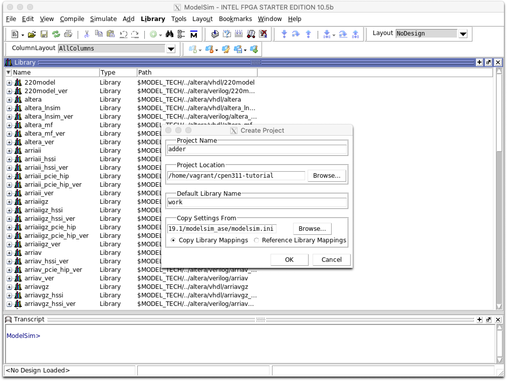

Next, select _Add Existing File_ and select **both** `.sv` files that you previously checked out as follows:

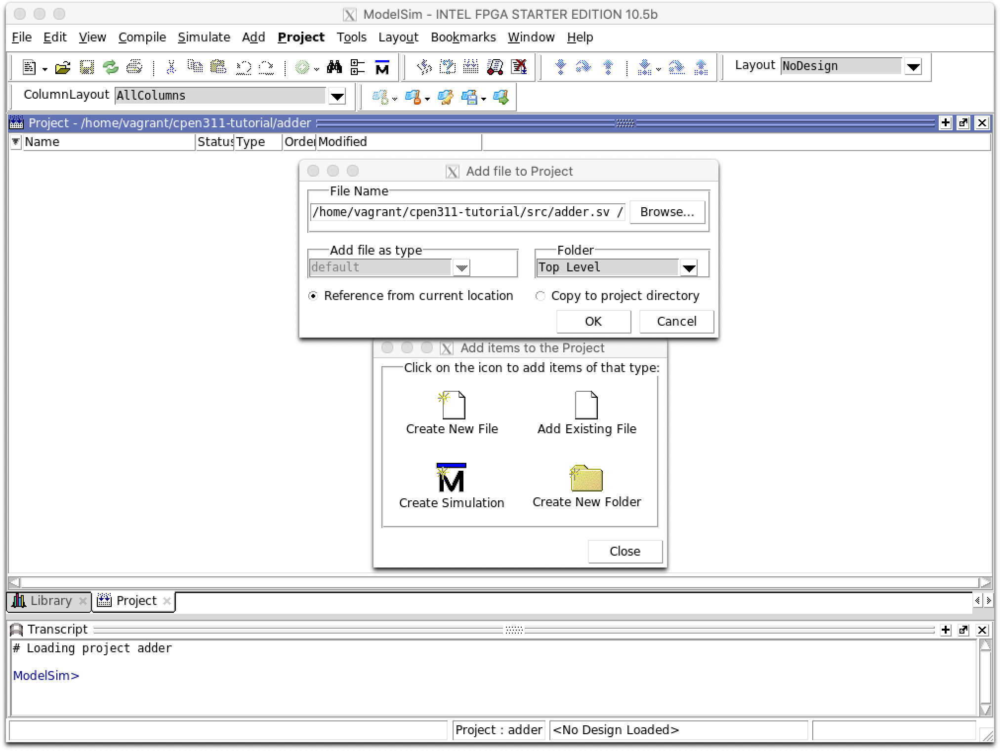

From the menu, select _Compile&rarr;Compile All_ to compile all the source files in your project (the  button does the same thing once you have clicked on any of the files).

You should now see that one of the source files, `adder.sv` will have compiled correctly (as indicated by a green tick in its status column, and a green “successful” message in the transcript window at the bottom), but `adder_tb.sv` failed. Double-click on the failed message in the transcript to see the error details:

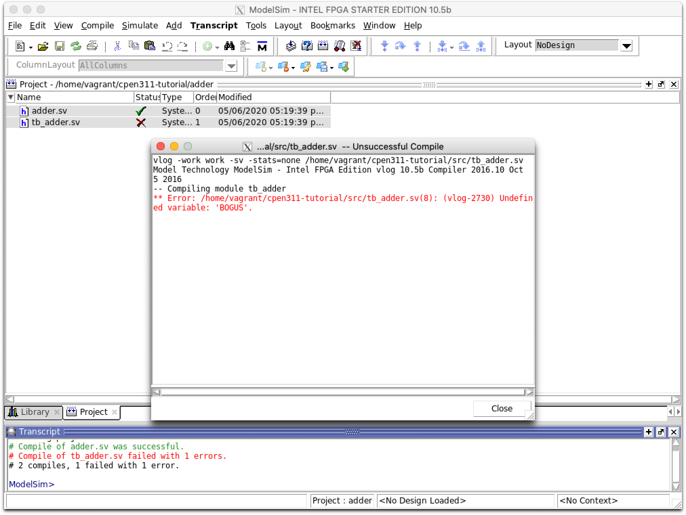

Next, double-click again on the first error message in the error details window; this will open the code up to the right of your Project window and helpfully take you to the vicinity of the error:

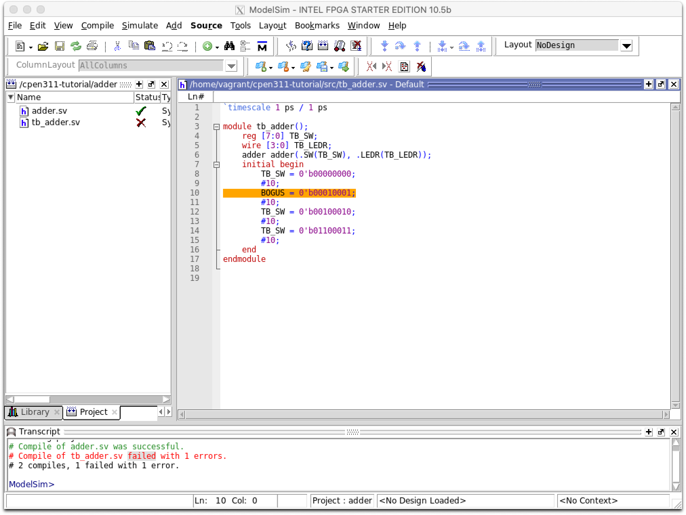

The error message here is complaining about an undefined variable. Fix the error by changing `BOGUS` to `TB_SW` and recompile; both files should now compile successfully.

Now comes the fun part, actually simulating your design. Select the _Library_ tab (left above the Transcript window) and open up the `work` library:

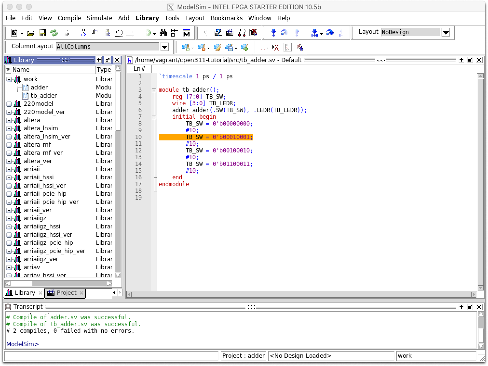

Double-click on the `tb_adder` module; this will open up your design:

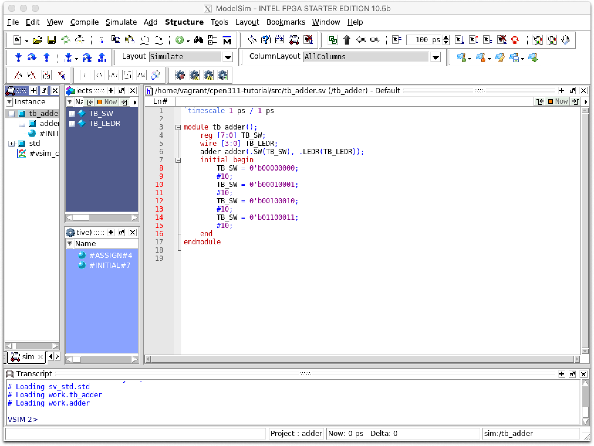

Select the signals that you want to see during simulation from the (dark blue) _Objects_ window by right-clicking inside and choosing _Add Wave_. For now, select all signals by choosing _Add To&rarr;Wave&rarr;Signals in Region_, which should bring you to this state:

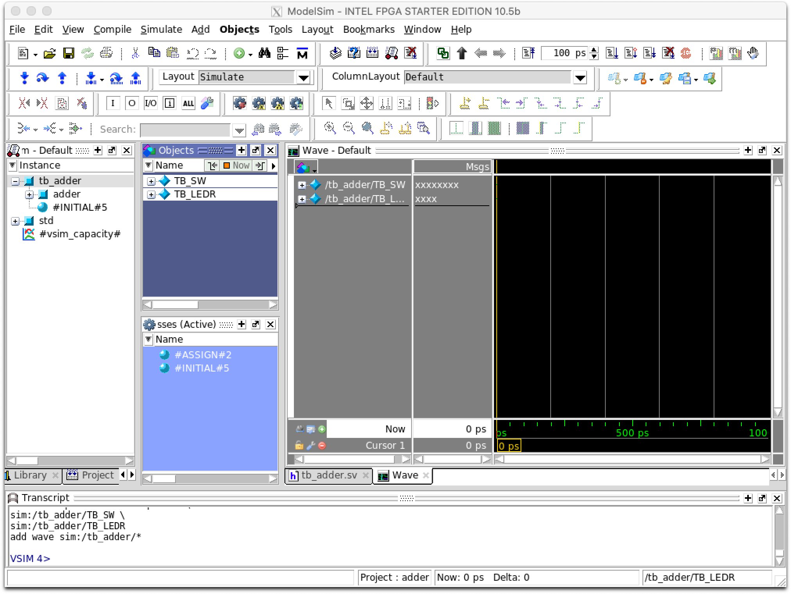

You can delete a signal by right-clicking on the item in the _Wave_ view and choosing _Edit&rarr;Delete_.

Change the _Run Length_ to “40 ps”, and click the _Run_ button  to the right. Now select the _Wave_ window by clicking anywhere in the waveform viewer, and then click on the _Zoom Full_ button  to view the whole waveform at once:

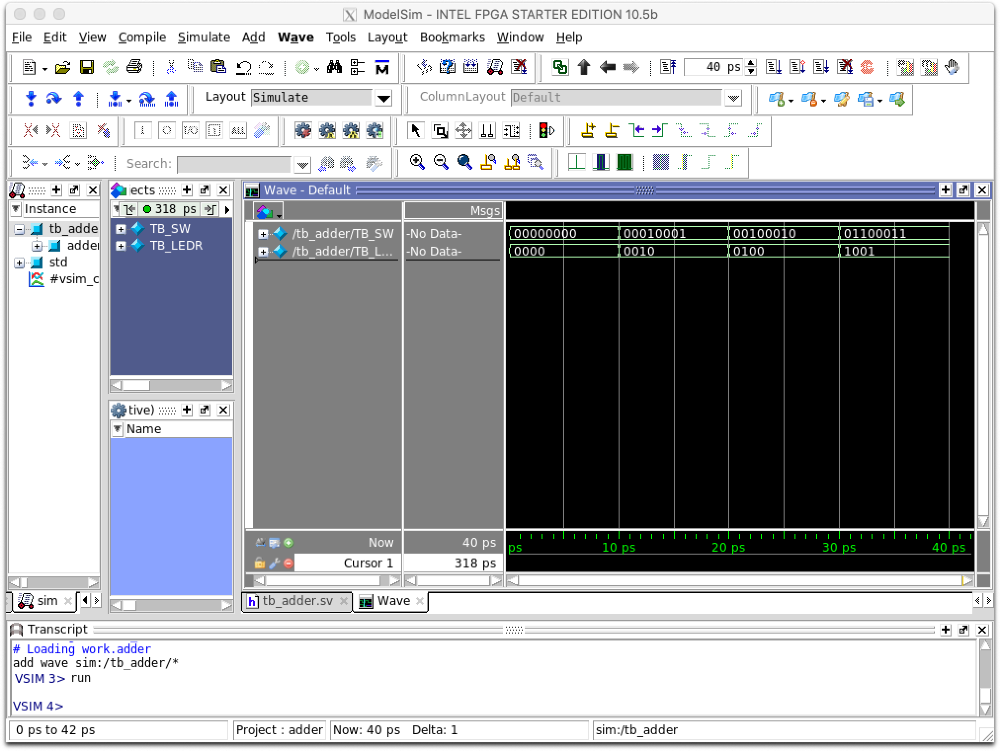

Study the waveforms carefully &mdash; initially, the switch inputs (SW) are all
zero, and hence `0000` + `0000` gives a zero output on the LEDR wires. Check that the other test cases are also correct. Run the simulation again for another 40 ns, and _Zoom Full_ again. What do you see?

Another way to run your simulation is by using the command-line interface (CLI). You may have noticed that clicking on the _Run_ button will result in a `run` command issued in the transcript window. Try it for yourself by entering `run 100ns` onto the command line.

A very useful feature in ModelSim is to be able to restart a simulation, whilst keeping the signals selected in the waveform viewer intact. The restart button is located to the left of the _Run Length_ text box &mdash; try it to make sure that it works. In the future, when you come to write your own Verilog, you will find that you can edit your code, re-compile it, and then restart the simulation using this button without having to go through the whole setup procedure that we just went through. In the CLI, this can also be achieved using the `restart` command.

Many, many other commands exist for use in this ModelSim Tcl interface: almost everything you can do using the graphical interface can be done with the command line, which will even allow you to automate sequences of tasks. In time, you'll come to learn more commands and embrace some as your favourites.

To save your simulated waveforms for a report, select the waveform window by clicking anywhere inside, and then choose _File&rarr;Export&rarr;Image_.

## Synthesis with Quartus Prime

Now that you have fully simulated your design and are (fairly) confident that it works, it is time to compile it into real hardware to be implemented on our FPGA.

Start up Quartus, and choose _New Project Wizard_. Click _Next_ to advance on to the second page, and you should end up here:

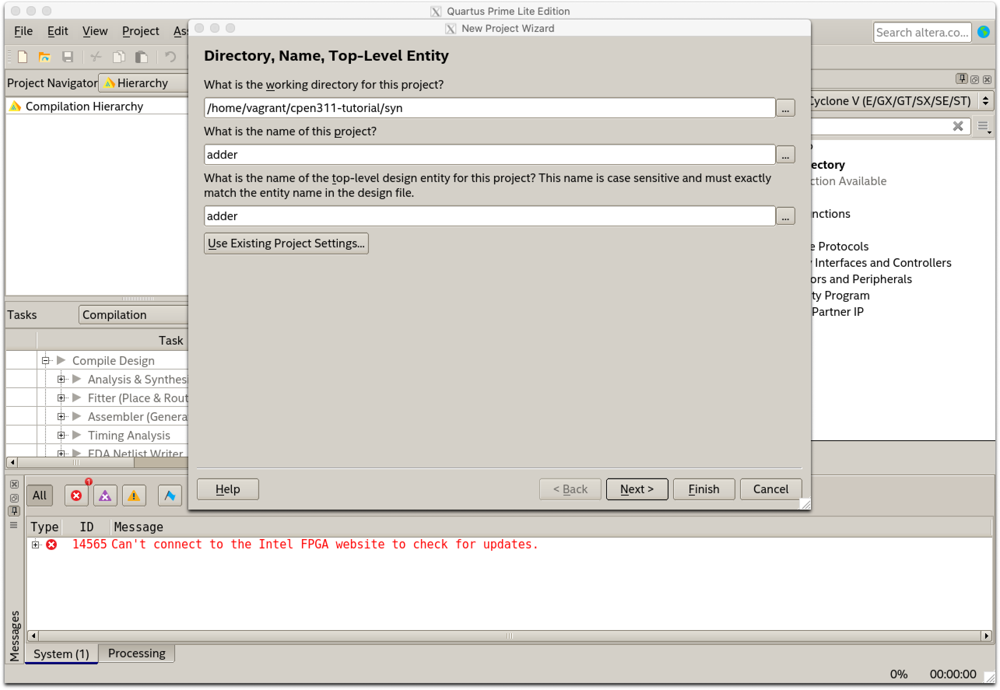

Again, you may choose any working directory, but **it is crucially important that you enter the top-level design entity name as shown**. This top-level design entity represents the topmost entity or module (i.e. the one which contains all other entities) that is to be implemented in hardware, and its name must match the entity name inside its Verilog file. In this document, this entity is **adder**. You should create this as an _Empty Project_ (next screen).

On the _Add Files_ screen, add _only_ the `adder.sv` file, which
contains our circuit description. The test-bench is not necessary for hardware implementation because we will be able to physically change the inputs of the actual circuit. Furthermore, the Verilog used in test-benches is _unsynthesizable_. Make sure you click the _Add_ button after browsing for the file, otherwise it will not be added. You should now see something like this:

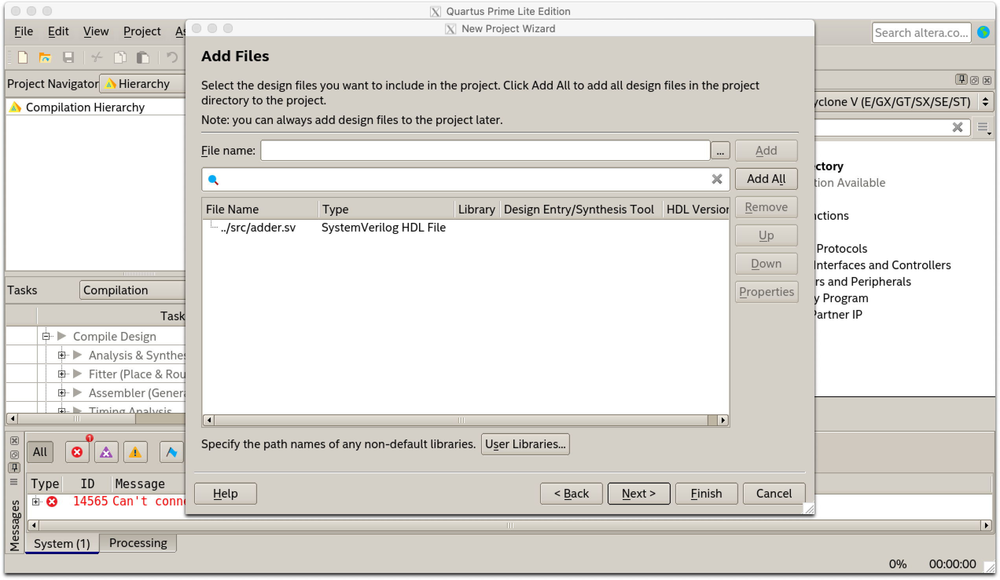

The subsequent menu will ask you to select the FPGA device to compile for. Different FPGAs have different ways of implementing circuit logic, and different numbers of pins so make sure you select the right model. Go to the _Board_ tab and select the board you have (`DE1-SoC` or `DE0-CV`). Set the _Create top-design file_ option to off; `adder.sv` will serve as our top-level file. Your selection should look like this:

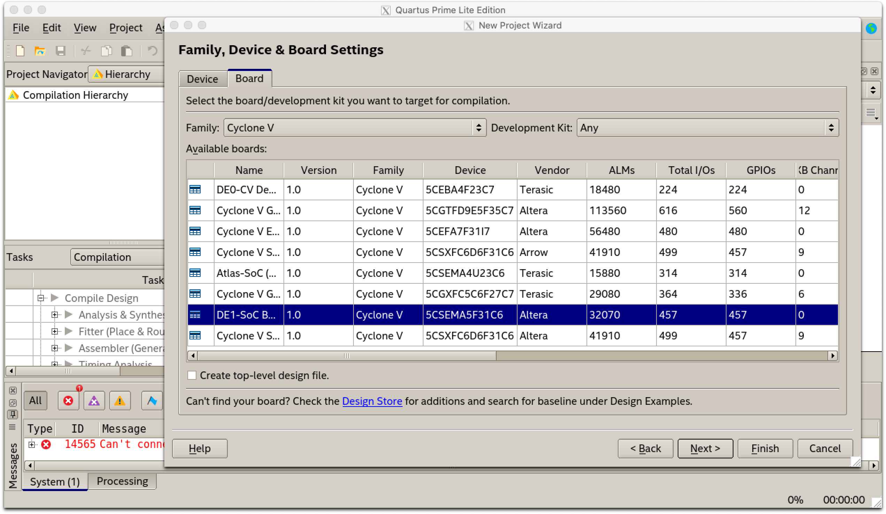

On the next screen, ensure that the _Simulation_ tool is set to _ModelSim-Altera_ with the _Verilog HDL_ format. Do **not** select automatic gate-level simulation after compilation. We will need this for netlist-level simulation after we have compiled our design.

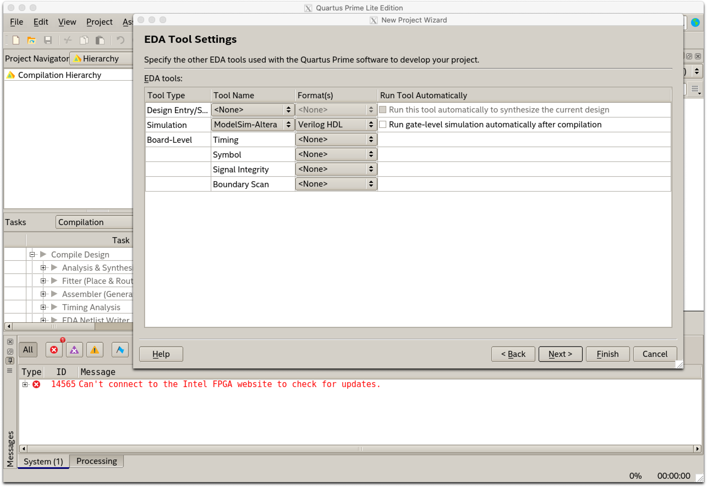

Next, you'll need to tell Quartus exactly which I/O pins of the FPGA are connected to which signals in the adder. Recall that we have used the _SW_ signal as the input, and _LEDR_ as the output. We need to tell Quartus exactly which pins those signals map to on the PCB.

**This is a CRITICALLY IMPORTANT step. Forgoing this task, or loading an incorrect assignments file, can DAMAGE YOUR FPGA!**

Find the `DE1_SoC.qsf` pin assignment file (or the equivalent for your board) in this repository. In Quartus, select _Assignments&rarr;Import Assignments_, and select the assignment file:

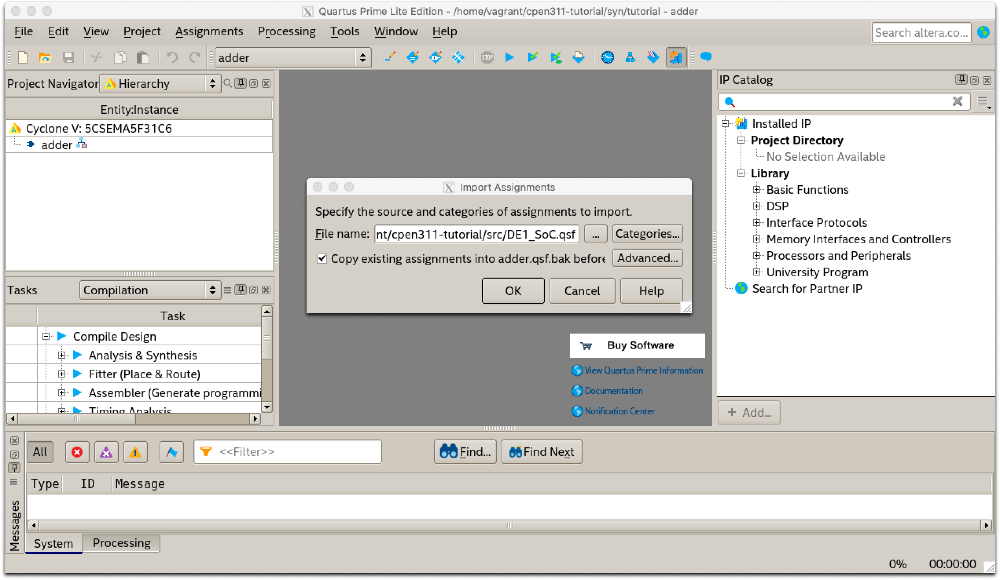

Ensure that an “Import Completed” message is visible in the output window on the bottom. The number of assignments depends on the development board.

Now you are ready to compile your design, so click on the aptly-named _Start Compilation_ button . (Alternatively, this is available under the _Processing_ menu.) Wait a little while for it to do its thing, after which you should see a successful report:

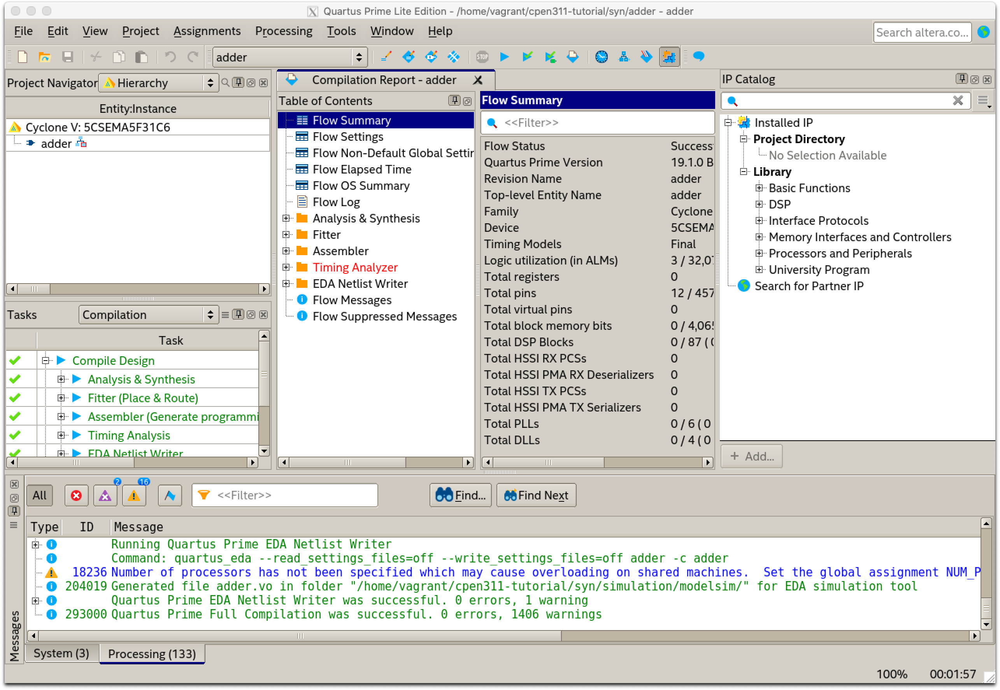

In the _Compilation Report_ tab, you can see what percentage of the FPGA resources was used by your design. The _Timing Analyzer_ leaf is red because we did not constrain any signals to run at a specific frequency; normally we would at least constrain the clock to run at a desired target frequency, but our design is purely combinational. You can also find these reports as `.rpt` and `.summary` text documents in the `output_files` folder.

If you don't, check that the Verilog source file was added successfully in _Assignments&rarr;Settings&rarr;Files_.

If your Verilog contains errors, you can double-click on `adder` in the top-left entity window to edit the files and fix them:

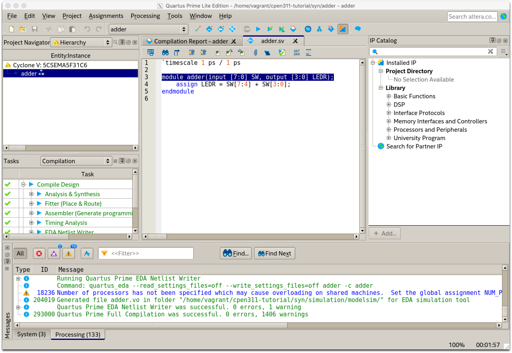

You may notice that even in an successful compilation, a number of info and warnings messages are still generated. Some of those messages are actually quite important, but aren't strictly errors (e.g., any “inferring latches” messages almost always indicate that you are describing some unintended behaviour in your Verilog). Over time and with experience you will come to learn which ones to look out for and what they mean.

Here's a handy checklist for Quartus-related problems:

- Are you using the correct version of Quartus?
- Is your disk full? (If it is, Quartus will not be able to create any new files and will crash. Delete a few things off it and try again. **Hint:** the `db` and `incremental_db` folders in old projects take up considerable space and can be safely deleted.)
- Is your top-level entity set correctly? (You can change this in _Assignments&rarr;Settings&rarr;General_.)
- Have you set the correct FPGA device model? (You can change this from _Assignments&rarr;Device_.)
- Have you added all source files into your project? (Check in _Assignments&rarr;Settings&rarr;Files_.)
- Have you correctly imported your pin assignments? (You can import them again and recompile if you are not sure.)

## Programming the FPGA

The next step of this tutorial is to program the FPGA chip on your development board. One output of Quartus from the previous section is a file with a `.sof` extension, known as a _bitstream_. This bitstream describes the digital logic used to implement the described circuit in a format specific to the selected FPGA model.

Attach the power cable to the power connector of your development board, and the USB cable to the _USB BLASTER_ port.

For the DE0-CV, ensure that the programming switch (below the red power switch, and left of the LCD screen) is set to the _RUN_ mode. This enables the FPGA to be temporarily programmed, which is sufficient for this course, as opposed to storing the bitstream permanently into the flash memory. Also, while the DE0-CV can be powered from the USB cable, we suggest using the power adapter.

If you are using your own computer running Windows, you might see that it will prompt you to install a driver for the new USB device that you have just attached. If so, tell it to search for the driver in a folder inside the Quartus Prime install directory.

To transfer the bitstream onto the FPGA, we will be using the _Programmer_ tool. Select it inside Quartus from _Tools&rarr;Programmer_, or click on its button  from the same toolbar where you found _Start Compilation_, which should bring up a window with the device chain your programming file is targeting, like this:

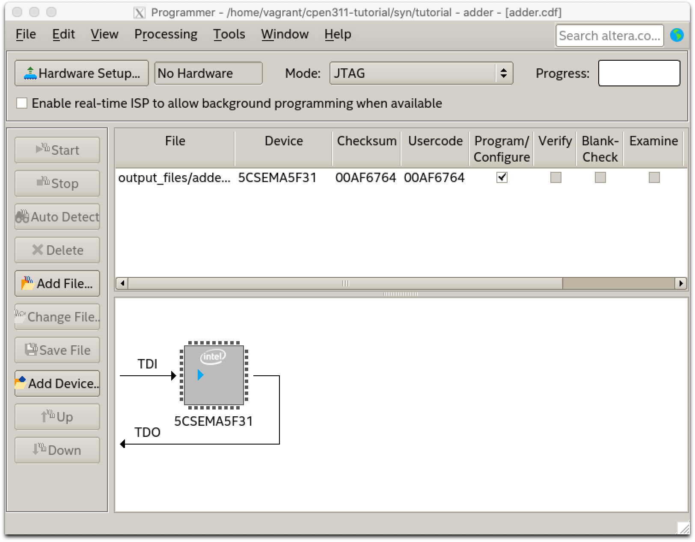

Click on the _Hardware Setup_ button in the top left of the Programmer.
From the _Currently selected hardware_ drop-down box, select your device:

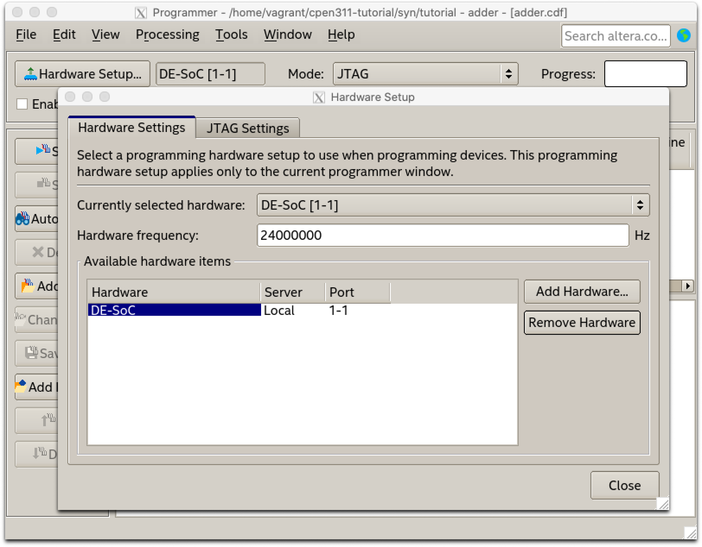

(On some systems the device port is called _USB Blaster_). If you cannot find your device, ensure that the USB cable is plugged in to the BLASTER port on the development board, that the other end is in a working port on your computer, and that the board is powered on.

Now you need to add the bitstream file, `adder.sof`. Use _Auto Detect_ to see the device chain, which will also check that the device is connected correctly. When prompted, **select the device that corresponds to your board:** `5CSEMA5F31C6` for the DE1-SoC, or `5CEBA4F23C7` for the DE0-CV.

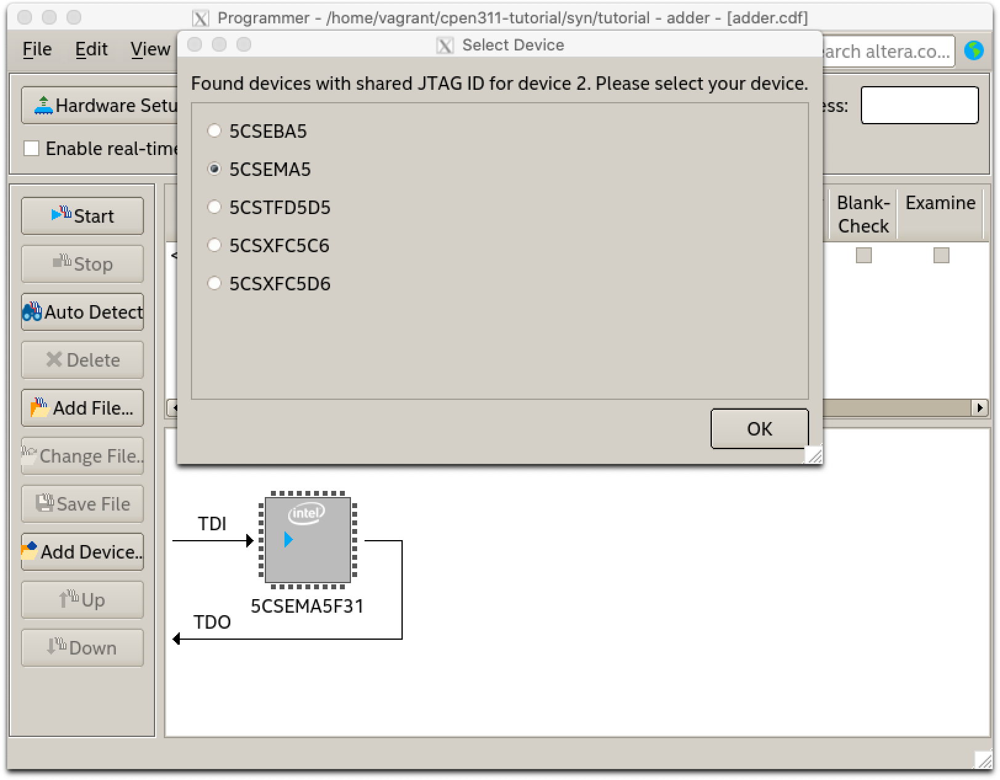

If prompted to overwrite the Programmer's device list settings with the autodetected devices, select Yes.

For the DE1-SoC, there should be **two** devices in the chain. Click on the FPGA you want to program (for the DE1-SoC, this is the second device in the chain, `5CSEMA5...`), click the _Change File_ button on the left, and select `output_files/adder.sof`. This should cause your `5CSEMA5` device to change to the specific `5CSEMA5F31` variant you compiled for; if the chain now contains three devices and the `5CSEMA5` chip is still there, simply delete it.

Now, enable the checkbox for your device under _Program/Configure_ tab and ensure that the _Mode_ drop-down says “JTAG”. Quartus will not let you program a bitstream intended for another model; if you have trouble, check that the FPGA model is set correctly.

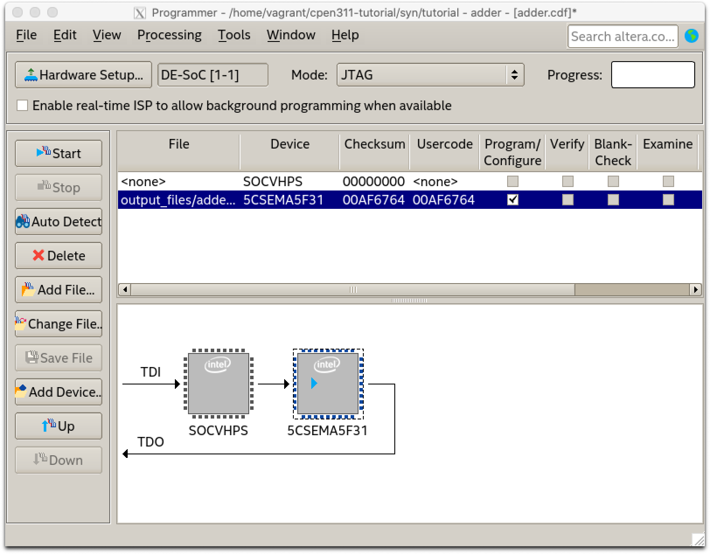

Finally, click on the _Start_ button in the top left corner of the Programmer. The progress bar should say “100% (Successful)”. Play around with the SW0-7 switches on your DE1-SoC board to ensure that the adder is working correctly.

In case you have problems, here's a handy checklist for any Programmer-related problems:

- Are you using the correct version of Quartus?
- Is your drive full? (If it is, Quartus will not be able to create any new files and will crash. Delete a few things off it and try again.)
- Have you set the correct FPGA model? (You can change this from _Assignments&rarr;Device_.)
- Have you attached the USB cable to the “BLASTER” port on the development board?
- Is the programming switch set to “RUN”? (DE0-CV only)
- Is the board powered on?
- Is the USB-Blaster driver installed correctly?
- Is your board (or “USB-Blaster”) displayed beside the “Hardware Setup” button? (If not, press the button and select it. If it is not listed, check that the board is turned on, the cable is connected properly, and the USB-Blaster drivers are installed.)

## Post-synthesis simulation

The synthesis process converts your Verilog design, which is actually written in high-level Verilog, into a very basic low-level format.
This low-level format will contain very basic logic gates and estimates for the time delays -- the precise format will depend upon the
target technology. This output is called a post-synthesis netlist, and it can also be described by the Verilog language. As a result,
the post-synthesis netlist can also be simulated in ModelSim. Simulating this netlist is important, because it contains all of the
optimizations and transformations made by the synthesis tools, as well as time delays, which allow for detailed timing-oriented
simulation as well as more accurate power estimation.

For FPGAs, the output is a description of your design in terms of the primitive
elements available on the FPGA: logic array blocks (LABs), I/O buffers, and so
on (if you were building an ASIC, the primitive elements would be ASIC library
cells).  The post-synthesis netlist is just a Verilog file that instantiates
and connects these primitive elements. You can find it in the
`simulation/modelsim` folder, in our case `adder.vo`.

In the ASIC flow, simulating the netlist is an important part of the process: nobody _really_ trusts the synthesis tools to be bug-free, and re-spinning a broken ASIC costs upward of a million dollars, so it makes sense to be careful.

If you do not have a physical FPGA board available, you can use ModelSim to
simulate how the FPGA would behave by using the post-simulation netlist instead
of your original design files.  This allows us to determine whether your
Verilog code was correct, and whether it was correctly synthesized, since the
synthesis process can sometimes produce different outputs than simulating the
original code (especially if accidentally you use non-synthesizable Verilog).
We will therefore evaluate your design in part by (automatically) synthesizing
it in Quartus and simulating the post-synthesis netlist — and you should do the
same to ensure that you receive full marks in your labs.

To simulate the netlist, you will follow the same steps to create a simulation
project as in the [Simulating](#simulating-using-modelsim) section, except that
you will combine the testbench with the netlist (`adder.vo`) instead of your
Verilog design (`adder.sv`). Compile the design as before.

However, we cannot directly simulate the design like we did before: the netlist instantiates primitive FPGA modules like `cyclone_lcell_comb` and `cyclone_io_ibuf`, so the simulation will fail unless we tell ModelSim where to find these modules.

To do this, make sure you've compiled the design, and go to _Simulate&rarr;Start Simulation..._ and select the _Libraries_ tab. In the _Search Libraries (-L)_ box, add the `cyclonev_ver` library, which defines the FPGA primitive cells for your Cyclone V FPGA:

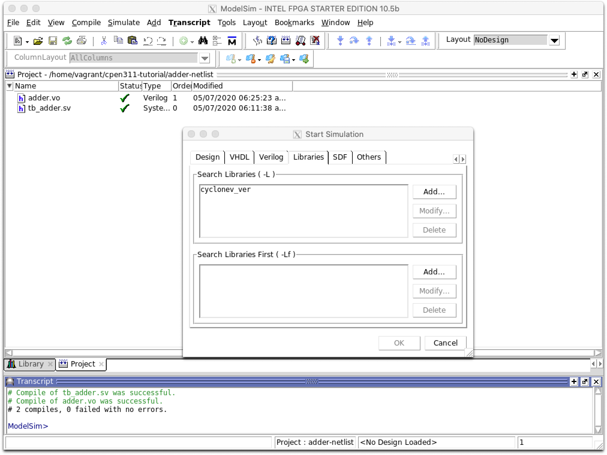

Then got to the _Design_ tab and select the `work.tb_adder` design as before:

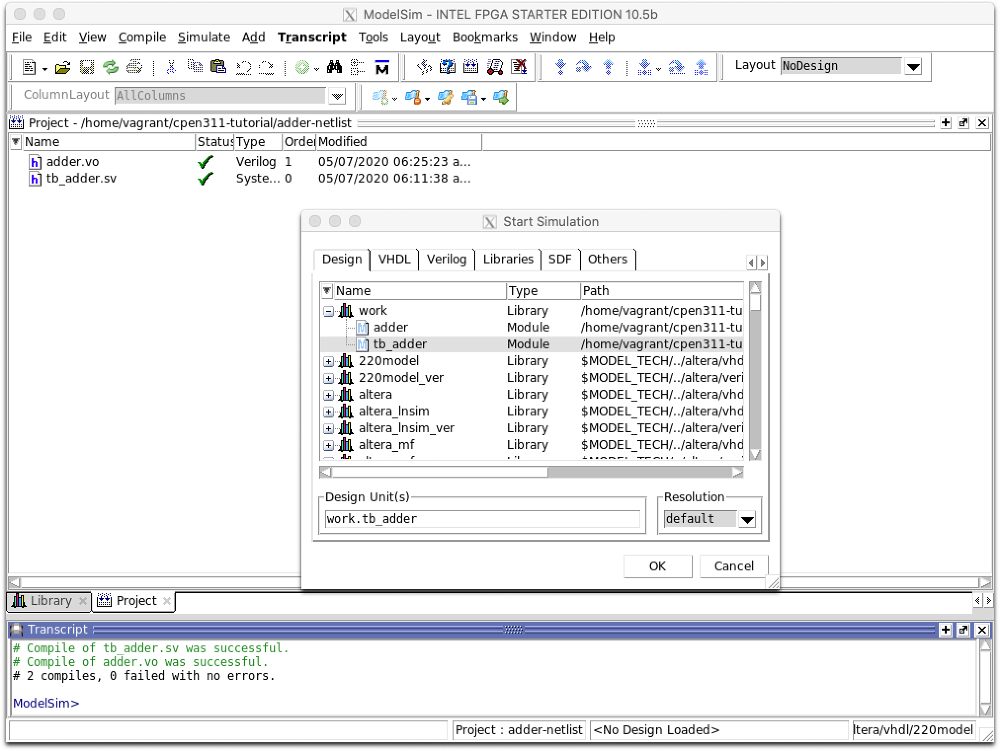

This will load the design for simulation as before. Now, however, you can see a lot of Quartus-generated signals in addition to the `SW` and `LEDR` that you had in your SystemVerilog design:

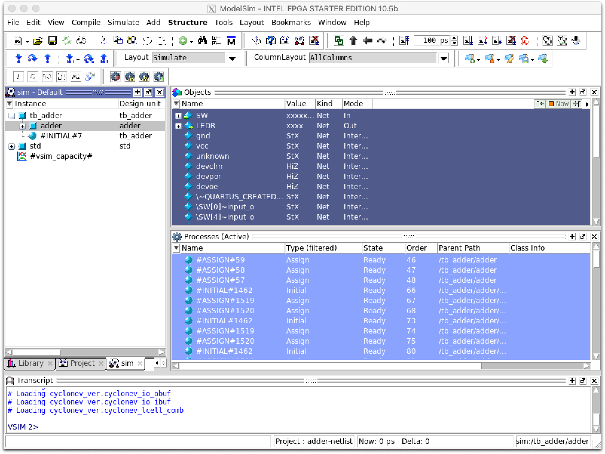

When you simulate, you can also see how the signals in the synthesized design change:

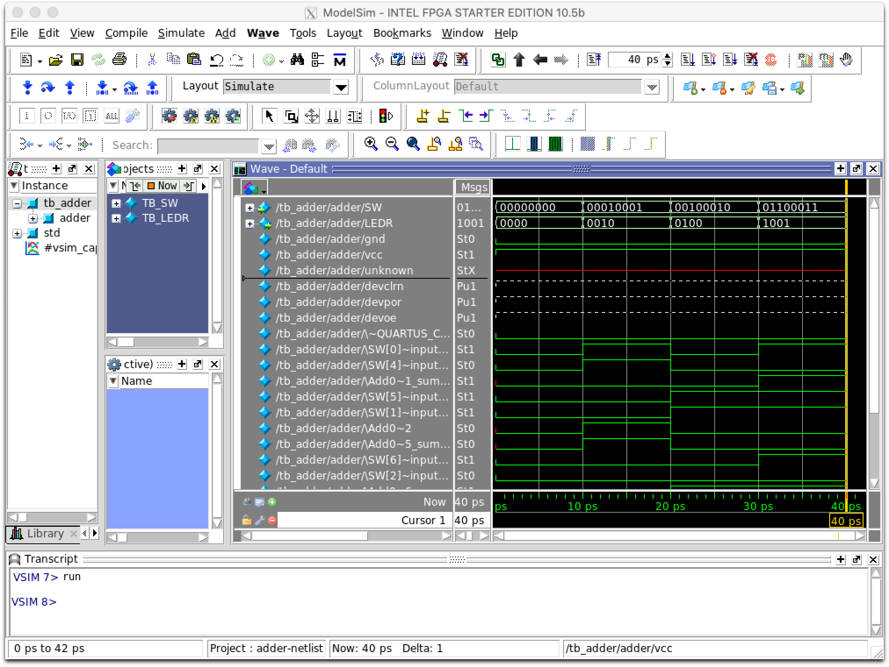

In a more complicated design, you would see many more additional signals, and most of the internal variables in your SystemVerilog RTL would have been compiled away; only top-level module ports, like `SW` and `LEDR` here, will be preserved. This means that during post-synthesis simulation you cannot reach inside your module to examine or toggle the internal signals, so your post-synthesis testbench can only do “black-box” testing.

## GitHub submissions and autograding

The last part of this tutorial is to make sure that you can push your modified
Verilog to the GitHub repository in preparation for autograding.

In the folder `lab0`, you will find a short Verilog file `lab0.sv`. Edit this
file, uncomment the code describing the active-low synchronous reset.  Simulate
the design in ModelSim -- did you find any errors? If so, correct them.

Finally, push your modified file back to GitHub before the lab deadline.

At some point after the deadline, the TA will run the autograder and verify
whether you modified the file correctly. When complete, the TA will push the
autograder report back into your GitHub repository.

## Conclusion

That's it for the tutorial! Now you know how to simulate your RTL design in ModelSim, synthesize it using Quartus, program it on your FPGA, and simulate the post-synthesis netlist.

Good luck with the rest of the course!

<!-- version history
1.0: Eddie Hung: created
1.1: 2016-09-06: Jose Pinilla: DE1-SoC and DE0-CV instructions
1.2: 2017-12-30: Mieszko Lis: GitHub release
1.3: 2020-05-06: Mieszko Lis: Pandemic edition: netlist simulation instructions
-->
