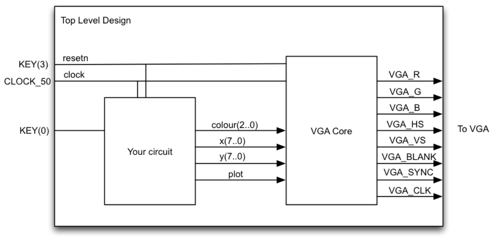
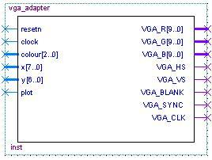
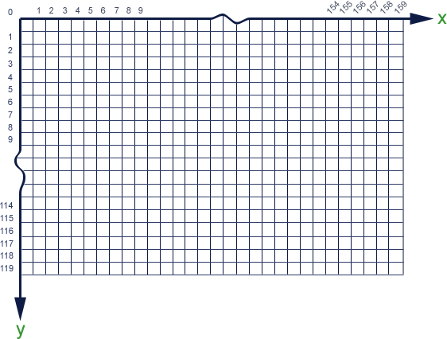
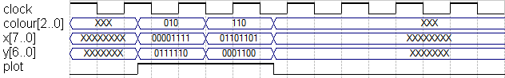
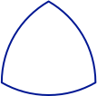
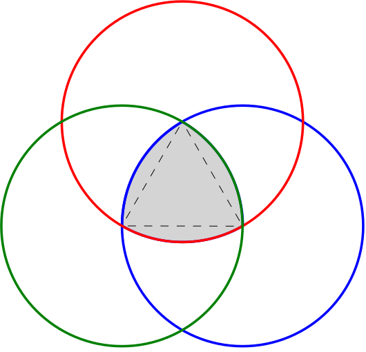

# Lab 2: Circles and Triangles

## Contents

* [Overview](#overview)
* [External IP](#external-ip)
  * [Task 1: Understanding the VGA adapter core](#task-1-understanding-the-vga-adapter-core)
* [Design](#design)
  * [Task 2: Fill the Screen](#task-2-fill-the-screen)
  * [Task 3: Bresenham Circle Algorithm](#task-3-bresenham-circle-algorithm)
  * [Task 4: The Reuleaux triangle](#task-4-the-reuleaux-triangle)
* [Deliverables and Evaluation](#deliverables-and-evaluation)

## Overview

In this lab, you will get more experience creating datapaths and state machines. You will also learn how to use an embedded VGA adapter core that we will give you to draw images on the screen.

The top level diagram of your lab is shown below. The VGA Core is the part given to you, so all the excitement will be in the block labeled “your circuit.”

## External IP

In the digital design industry, most designs incorporate modules provided by another team or another company. In this lab, we provide you with a VGA adapter core that converts a framebuffer view of the screen to the actual signals expected on the physical VGA port.

### Task 1: Understanding the VGA adapter core

The VGA adapter was created at the University of Toronto for a course similar to CPEN 311. The description below is enough for you to use the core, but you can find the complete specification at [the original site](http://www.eecg.utoronto.ca/~jayar/ece241_07F/vga). Some of the following figures have been taken with permission from that website (with permission).

The VGA adapter has been set up to display a grid of 160×120 pixels, only _slightly_ worse than the [Atari 2600](https://en.wikipedia.org/wiki/Atari_2600_hardware). The interface is as shown below:

| Signal | Direction | Semantics |
| --- | --- | --- |
| resetn      | input  | active-low reset |
| clock       | input  | 50MHz clock |
| colour[2:0] | input  | pixel colour (3 bits), each bit indicating the presence of one of the RGB components |
| x[7:0]      | input  | x coordinate of pixel to be drawn (0 ≤ x < 160) |
| y[6:0]      | input  | x coordinate of pixel to be drawn (0 ≤ x < 120) |
| plot        | input  | active-high plot enable signal |
| VGA_CLK     | output | VGA clock (25 MHz) |
| VGA_R[9:0]  | output | VGA red component |
| VGA_G[9:0]  | output | VGA green component |
| VGA_B[9:0]  | output | VGA blue component |
| VGA_HS      | output | VGA horizontal sync |
| VGA_VS      | output | VGA vertical sync |
| VGA_SYNC    | output | VGA special synchronization mode |
| VGA_BLANK   | output | VGA special blank mode |

You will connect all outputs of the VGA core directly to the appropriate output pins of the FPGA. The VGA core will then continuously draw pixels on a VGA monitor connected to your board.

You can picture the VGA pixel grid as shown below. The (_x_,_y_) position (0,0) is located on the top-left corner and (159,119) is at the other extreme end. The pixel colours are stored in each cell. This grid is stored in on-chip memory, and is called a framebuffer.

Initially, all pixels have a value that depends on how the FPGA was powered up (black if you're lucky) because the framebuffer is just a memory on the FPGA. To change the colour of a pixel, you must write to the framebuffer memory. To do this, you drive the _x_ input with the x position of the pixel, drive the _y_ input with the y position of the pixel, and _colour_ with the colour you wish to use. You then raise the _plot_ signal. At the next rising clock edge, the new colour is written to the framebuffer. At some point in the near future, during the next screen refresh cycle, the entire framebuffer is read out and all of the then-current pixel colours will be drawn on the screen.

In the following timing diagram, two pixels are turned on: one at (15,62) and the other at (109,12). As you can see, the first pixel drawn is green and is placed at (15,62), while the second is a yellow pixel at (109,12). It is important to note that, at most, one pixel can be turned on each cycle — thus, if you want to turn on _m_ pixels, you need _m_ cycles.

The source code for the VGA adapter is in the `vga-core` folder in this repository.

To help you understand the interface, we have created a `vga_demo.sv` file which connects the core I/O to switches on the DE1-SoC so you can experiment. We suggest you understand this module and try it out to make sure you understand how the inputs of the core work. (Note that you will not use this file for the other tasks in this Lab.)

#### VGA bus widths on the DE1-SoC and DE0-CV

The VGA module we have provided has 10 bits of precision for the VGA red, green, and blue component signals. The DE1-SoC FPGA board we are using, though, has a DAC with only has 8 bits of precision for the same signals (you can see this in the pin assignment file). This means that you need to take the 8 most significant bits output by the VGA adapter core to drive the board outputs. (If you are using the DE0-CV, the DAC is even more primitive and only has 4 bits of precision for the three signals.)

#### Simulation with the VGA core

To simulate the VGA core in ModelSim, you will need to load the `altera_mf_ver` library to provide the block RAMs and PLL modules needed by the VGA core. For post-synthesis simulation, you will additionally require `cyclonev_ver`, `altera_ver`, and `altera_lnsim_ver` to model the FPGA logic cells, registers, and internal memories.

We have also hacked up a simulation GUI similar to the one from Lab 1. It intercepts the signals passed to the VGA adapter and draws the pixels in an on-screen window. You need to load the `de1_vga_gui.tcl` script as you did for the GUI in Lab 1 (quo vide); the SystemVerilog component is included in the VGA adaptor Verilog (at the end of the file). If you wish, you can use this in conjunction with the fake DE1-SoC GUI from Lab 1, which might be helpful for Task 1; read Lab 1 for details.

Note that your testbenches must not access any VGA adapter internals and must not depend on the GUI — the autograder will use its own “fake” implementation of the VGA adapter.

#### Verification with the VGA core

So how do you verify that things are working?

Well, if you were really building a chip, you would verify the entire thing end-to-end by checking that the analog VGA outputs are exactly what they should be. But to save you some time (and learning the finer points of VGA signalling), we will not require you to test the VGA core itself — i.e., for this lab, it will suffice to test the inputs that go into the VGA core.

This is easy to do with the RTL, since you can reach in and look at what is being fed to the VGA core. But what about the post-synthesis netlist? All those signals will have gone away, so you can't reach in and examine them using hierarchical naming.

To help you with this, we have provided external ports for the VGA core inputs in the toplevel files. These ports will survive synthesis (and, indeed, be assigned pin locations on the FPGA), so you will be able to access them to validate your post-synthesis netlist.

## Design

### Task 2: Fill the Screen

You will first create a simple circuit that fills the screen. Each column will be a different colour (repeating every 8 columns). Remember that you can only turn on one pixel at a time, so you would need an algorithm similar to this pseudocode:

    for x = 0 to 159:
        for y = 0 to 119:
            turn on pixel (x, y) with colour (x mod 8)

You are to create a circuit that implements the above algorithm. A skeleton file `fillscreen.sv`, and a top-level skeleton `task2.sv`, are in the task2 folder.

The interface to the `fillscreen` module is as follows:

| Signal | Direction | Semantics |
| --- | --- | --- |
| clk       | input  | clock |
| rst_n      | input  | active-low _asynchronous_ reset |
| colour    | input  | fill colour (ignored for Task 2) |
| start     | input  | assert to start filling the screen |
| done      | output | goes high once the entire screen is filled |
| vga_*     | output | outputs to the VGA adapter core |

The user of this module will assert `start` and hold it high until your module asserts `done`. You will need to ignore the `colour` input for Task 2, but it will be useful for the later tasks.

The `task2` module is the toplevel module you will load into the FPGA. It should instantiate the VGA adapter and your `fillscreen` module, and fill the entire screen with the colour stripes on reset (KEY3, active-low, asynchronous). This must be finished in 19,210 cycles of CLOCK_50 from the time the reset is _deasserted_, i.e., one cycle per screen pixel plus 10 extra cycles; you will need to finish drawing and then assert `done` at some point within that time budget.

Note that you are using CLOCK_50, the 50MHz clock, to clock your circuit. This is different than Lab 1 where you used a pushbutton switch for your clock.

Exhaustively test your design by writing a testbench and simulating everything in ModelSim (hint: look at the counters first). You will need to demonstrate and submit comprehensive testbenches both for the fillscreen module and the toplevel module, with separate RTL and netlist testbenches.

Make sure your pixel colours are correct. The autograder will compare them against the reference solution.

### Task 3: Bresenham Circle Algorithm

The Bresenham Circle algorithm is an integer-only circle-drawing algorithm. The basic algorithm is described in the following pseudocode (modified from Wikipedia):

    drawCircle(centre_x, centre_y, radius):
        offset_y = 0
        offset_x = radius
        crit = 1 - radius
        while offset_y ≤ offset_x:
            setPixel(centre_x + offset_x, centre_y + offset_y)   -- octant 1
            setPixel(centre_x + offset_y, centre_y + offset_x)   -- octant 2
            setPixel(centre_x - offset_x, centre_y + offset_y)   -- octant 4
            setPixel(centre_x - offset_y, centre_y + offset_x)   -- octant 3
            setPixel(centre_x - offset_x, centre_y - offset_y)   -- octant 5
            setPixel(centre_x - offset_y, centre_y - offset_x)   -- octant 6
            setPixel(centre_x + offset_x, centre_y - offset_y)   -- octant 8
            setPixel(centre_x + offset_y, centre_y - offset_x)   -- octant 7
            offset_y = offset_y + 1
            if crit ≤ 0:
                crit = crit + 2 * offset_y + 1
            else:
                offset_x = offset_x - 1
                crit = crit + 2 * (offset_y - offset_x) + 1

In this task, you are to implement a circuit that draws a circle with its centre at specified coordinates, a specified radius, and a specified colour. The interface to this `circle` module is as follows:

| Signal | Direction | Semantics |
| --- | --- | --- |
| clk       | input  | clock |
| rst_n      | input  | active-low _asynchronous_ reset |
| colour    | input  | drawing colour |
| centre_x  | input  | the x-coordinate of the centre |
| centre_y  | input  | the y-coordinate of the centre |
| radius    | input  | the radius in pixels |
| start     | input  | assert to start filling the screen |
| done      | output | goes high once the entire circle is drawn |
| vga_*     | output | outputs to the VGA adapter core |

As with the `fillscreen` module, we will assert `start` and hold it high until your module asserts `done`.

Your `circle` module must work for _any_ centre and radius inputs, _including_ centres and radii where parts of the circle would be off the screen (in which case you must draw only the on-screen parts). Any pixels whose coordinates fall outside of the screen area must not be drawn.

The clock cycle budget you have for `circle` is the number of pixels that are actually drawn for the circle with the specified radius, plus 10 extra cycles. This budget includes pixels that _would have been_ drawn if the circle fit on the screen. You must assert `done` within the cycle budget to receive full credit.

The top-level module `task3` will, on reset (KEY3, active-low, asynchronous), fill the screen with black pixels, and draw a pure-green circle with the centre at (80,60) and a radius of 40; the clock cycle budget for this is 19,200 plus your `circle` budget plus 10. Note that you must clear the screen to black even if on your board is initially black; the initialization state of circuits cannot in general be relied upon and the autograder will treat the screen as initially undefined. Also note that the autograder will test both your `circle` module with different radii, not just the toplevel.

In designing the datapath for this algorithm, remember that you can only update one pixel per clock cycle. This means that each iteration through the loop should take at most 8 clock cycles to draw one pixel in each octant.

As before, you will need to demonstrate and submit comprehensive testbenches both for the circle module and the toplevel module, separately for RTL and for the netlist.

Be especially careful that your pixel positions are **exactly correct**. The autograder will compare the pixels you output against the reference solution, looking for pixels that overlap, extra pixels, and missing pixels. If you draw a circle in a different place than requested or with an incorrect radius, it is not likely that many pixels will overlap.

### Task 4: The Reuleaux triangle

This task requires you to draw a [Reuleaux triangle](https://en.wikipedia.org/wiki/Reuleaux_triangle). This is a figure similar to a chubby equilateral triangle, where each triangle side is replaced by a section of a circle centred at the opposite corner:

You can think of this figure as the boundary of the intersection of three circles like this:

For the Reuleaux triangle, the _centre_ is defined as the point equidistant from all three corners, while the _diameter_ D is defined as usual as any segment that passes through the centre and whose endpoints lie on the Reuleaux triangle. Observe that this diameter is the same as the length of one side of the inscribed triangle, R1 + R2, and the same as the _radius_ of the three circles used to construct it.

Your job is to write a module which draws this figure with the centre coordinates and the diameter as inputs (pointy end up, as in the figures above). You will probably want to use your circle design and carefully control when the pixels are drawn.

Any fractional coordinates that you may need to compute should be truncated down to the nearest integer. Because of rounding,  you will want to use the same integer-based equations as the autograder for the location of the three corners:

    assign c_x = centre_x;
    assign c_y = centre_y;
    assign c_x1 = c_x + diameter/2;
    assign c_y1 = c_y + diameter * $sqrt(3)/6;
    assign c_x2 = c_x - diameter/2;
    assign c_y2 = c_y + diameter * $sqrt(3)/6;
    assign c_x3 = c_x;
    assign c_y3 = c_y - diameter * $sqrt(3)/3;

Because of rounding, there may be pixel errors.  To minimize these on our side,
we will only test your triangle with even diameters.  To minimize these on your
side, be careful when clipping (i.e., omitting portions of the circle when
drawing).  Clipping introduces up to four thresholds for the minimum or maximum
values of x and y.  To reduce errors, choose as few thresholds as needed using
the 3 sets of known corner coordinates.

The interface for module `reuleaux` is the same as the one for `circle` from Task 3, except we specify the _diameter_ of the Reuleaux triangle instead of the radius of the circle.

The clock cycle budget you have for `reuleaux` is the number of cycles that would be required to fully draw all three circles used to construct the Reuleaux triangle, plus 15 cycles; this includes pixels that fall outside of the screen coordinates. The `done` signal that indicates you are finished must be asserted within this budget. (Note that this is _a lot_ more than is needed to draw the actual triangle; you might want to think about how you would do it without wasting cycles on pixels you never draw.)

At the toplevel stage you will need to clear the screen to black, and draw a green Reuleaux triangle with the centre at (80,60) and a diameter of 80, so that is what your top-level module `task4` must do on reset (KEY3, active-low, asynchronous). The cycle budget is 19,200 plus your `reuleaux` budget, plus 10 cycles.

As before, you will need to demonstrate and submit comprehensive testbenches both for the reuleaux module and the toplevel module, both for the RTL and the netlist.

Be especially careful that your pixel positions are **exactly correct**. As with the circle task, the autograder will compare pixel positions against a reference solution.

## Deliverables and Evaluation

### Automatic testing

We will be marking your code via an automatic testing infrastructure. Your autograder marks will depend on the fraction of the testcases your code passed (i.e., which features work as specified), and how many cases your testbenches cover.

It is essential that you understand how this works so that you submit the correct files — if our testsuite is unable to compile and test your code, you will not receive marks.

The testsuite evaluates each task separately. For each design task folder (e.g., `task4`), it collects all Verilog files (`*.sv`) that do not begin with `tb_` and compiles them **all together**. Separately, each required `tb_*.sv` file is compiled with the relevant `*.sv` design files. This means that

1. You must not **rename any files** we have provided.
1. You must not **add** any files that contain unused Verilog code; this may cause compilation to fail.
1. Your testbench files must begin with `tb_` and **correspond to design file names** (e.g., `tb_rtl_foo.sv` and `tb_syn_foo.sv` for design `foo.sv`).
1. You must not have **multiple copies of the same module** in separate committed source files in the same task folder. This will cause the compiler to fail because of duplicate module definitions.
1. Your modules must not **rely on files from another folder** with the exception of the VGA modules. The autograder will only look in the relevant task folder, and will have its own version of the VGA modules.
1. You must not copy the VGA files into the task folders; this will conflict with the autograder's custom VGA module.

The autograder will instantiate and test each module exactly the way it is defined in the provided skeleton files. This means that
1. You must not **alter the module declarations, port lists, etc.**, in the provided skeleton files.
1. You must not **rename any modules, ports, or signals** in the provided skeleton files.
1. You must not **alter the width or polarity of any signal** in the skeleton files (e.g., everything depending on the clock is posedge-triggered, and `rst_n` must remain active-low).
1. Your sequential elements must be triggered **only on the positive edge of the clock** (and the negative edge of reset if you have an asynchronous active-low reset). No non-clock (or possibly reset) signal edges, no negative-edge clock signals, or other shenanigans.
1. You must not add logic to the clock and reset signals (e.g., invert them). When building digital hardware, it is extremely important that the clock and reset arrive at exactly the same time to all your FFs; otherwise your circuit will at best be slow and at worst not working.

If your code does not compile, synthesize, and simulate under these conditions (e.g., because of syntax errors, misconnected ports, or missing files), you will receive **0 marks**.

As in Lab 1, you will submit your RTL and you may optionally submit the post-synthesis netlist `.vo` file (the autograder will generate its own netlist from your RTL and mark that, though). _Unlike_ in Lab 1, you will need to submit separate testbench files for the RTL and the post-synthesis netlist; see below for the naming convention.

### Marks

The evaluation of your submission consists of four parts:
- *30%*: automatic testing of your RTL code (`*.sv`)
- *20%*: automatic testing of your RTL testbench coverage (`tb_rtl_*.sv`)
- *30%*: automatic testing of the netlist we synthesize from your RTL
- *20%*: automatic testing of your post-synthesis testbench on the netlist we synthesize from your RTL (`tb_syn_*.sv`)

### Task 1

No deliverables.

### Task 2 [1 mark]

Deliverables in folder `task2`:

- Modified `task2.sv` (the toplevel)
- Modified `tb_rtl_task2.sv`
- Modified `tb_syn_task2.sv`
- Modified `fillscreen.sv`
- Modified `tb_rtl_fillscreen.sv`
- Modified `tb_syn_fillscreen.sv`
- Any other modified/added source/testbench files for your design
- Do not copy the VGA files into the task files; this will conflict with the autograder's custom VGA module

### Task 3 [4 marks]

Deliverables in folder `task3`:

- Modified `task3.sv` (the toplevel)
- Modified `tb_syn_task3.sv`
- Modified `tb_rtl_task3.sv`
- Modified `circle.sv`
- Modified `tb_rtl_circle.sv`
- Modified `tb_syn_circle.sv`
- Any other modified/added source/testbench files for your design
- Do not copy the VGA files into the task files; this will conflict with the autograder's custom VGA module

### Task 4 [5 marks]

Deliverables in folder `task4`:

- Modified `task4.sv` (the toplevel)
- Modified `tb_rtl_task4.sv`
- Modified `tb_syn_task4.sv`
- Modified `reuleaux.sv`
- Modified `tb_rtl_reuleaux.sv`
- Modified `tb_syn_reuleaux.sv`
- Any other modified/added source/testbench files for your design
- Do not copy the VGA files into the task files; this will conflict with the autograder's custom VGA module
