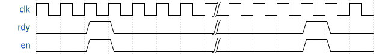

# Lab 3: Memories from Room 40

## Contents

* [Background](#background)
  * [ARC4 Decryption](#arc4-decryption)
  * [The ready\-enable microprotocol](#the-ready-enable-microprotocol)
  * [Length\-prefixed strings](#length-prefixed-strings)
  * [Embedded memories](#embedded-memories)
* [Designing the Decryption Circuit](#designing-the-decryption-circuit)
  * [General implementation requirements](#general-implementation-requirements)
  * [Task 1: ARC4 state initialization](#task-1-arc4-state-initialization)
  * [Task 2: The Key\-Scheduling Algorithm](#task-2-the-key-scheduling-algorithm)
  * [Task 3: The Pseudo\-Random Generation Algorithm](#task-3-the-pseudo-random-generation-algorithm)
  * [Task 4: Cracking ARC4](#task-4-cracking-arc4)
  * [Task 5: Cracking in parallel](#task-5-cracking-in-parallel)
* [Deliverables and evaluation](#deliverables-and-evaluation)
  * [Automatic testing](#automatic-testing)
  * [Marks](#marks)
* [Extra ciphertexts](#extra-ciphertexts)

## Background

In this lab, you will get experience creating a design that contains several on-chip memories, and uses a more efficient ready-enable interface to connect modules that have variable latencies.

The circuit you will create is an ARC4 decryption circuit. [ARC4](https://en.wikipedia.org/wiki/RC4) is a symmetric stream cipher, and was once widely used in encrypting web traffic, wireless data, and so on; it has since been broken. Still, the structure of ARC4 is similar to modern symmetric encryption methods, and provides a good vehicle for studying digital circuits that make extensive use of on-chip memory.

In the rest of the lab, you will first design an ARC4 decryption circuit. In the first phase, the secret key will be obtained from a bank of switches on your DE1-SoC board, and the encrypted message will be given to you as a memory initialization file. As in the previous labs, if you don't have a physical board, you may use the fake DE1-SoC GUI instead.

Next, you will extend this to build an ARC4 _cracking_ circuit; the circuit will implement a “brute-force” attack by cycling through the entire key space and stopping when a successful decryption is performed. Finally, you will create a cracking circuit with multiple decryption units to speed things up.

The description of this lab is fairly long, but this is mostly because it includes lots of explanations about ARC4, how to generate and examine memories, and so on. Do not be discouraged by this — once you understand how on-chip memories work, the amount of actual RTL you have to write is not terrible.

Finally, some debugging advice. More than prior labs, this one would benefit from having a “known good” high-level implementation that you can compare with step by step. You may write one in C or Python, for example. Of course, you don't have to do this, and you will not be marked on it, but it will make your life much easier.


### ARC4 Decryption

This section describes the ARC4 cipher. A stream cipher like ARC4 uses the provided encryption key to generate a pseudo-random byte stream that is xor'd with the plaintext to obtain the ciphertext. Because xor is symmetric, encryption and decryption are exactly the same.

The basic ARC4 algorithm uses the following parameters:

| Parameter | Type | Semantics |
| --- | --- | --- |
| `key[]` | input | array of bytes that represent the secret key (24 bits in our implementation) |
| `ciphertext[]` | input | array of bytes that represent the encrypted message |
| `plaintext[]` | output | array of bytes that represent the decrypted result (same length as ciphertext) |

and proceeds as shown in this pseudocode:

    -- key-scheduling algorithm: initialize the s array
    for i = 0 to 255:
        s[i] = i
    j = 0
    for i = 0 to 255:
        j = (j + s[i] + key[i mod keylength]) mod 256  -- for us, keylength is 3
        swap values of s[i] and s[j]

    -- pseudo-random generation algorithm: generate byte stream (“pad”) to be xor'd with the ciphertext
    i = 0, j = 0
    for k = 0 to message_length-1:
        i = (i+1) mod 256
        j = (j+s[i]) mod 256
        swap values of s[i] and s[j]
        pad[k] = s[(s[i]+s[j]) mod 256]

    -- ciphertext xor pad --> plaintext
    for k = 0 to message_length-1:
        plaintext[k] = pad[k] xor ciphertext[k]  -- xor each byte

The length of the secret key can vary — in this lab, we will use a smaller key of 24 bits (3 bytes) to ensure that you can “crack” the encryption in a reasonable amount of time.

Note that the key is stored [big-endian](https://en.wikipedia.org/wiki/Endianness). The following diagram shows the values of key[0], key[1], and key[2] for the 24-bit secret key of 'b000000110101111100111100 = 'h035F3C.

<p align="center"></p>


### The ready-enable microprotocol

In some of the previous labs, you used a simple start/done microprotocol to let your circuit take a variable number of cycles. In this lab, we will be using a slightly more sophisticated ready/enable microprotocol to achieve the same goal.

The handshake has two sides: the “caller” (think: employer) and the “callee” (think: employee). Whenever the callee is ready to accept a request, it asserts its `rdy` signal. If `rdy` is asserted, the caller may assert `en` to make a “request” to the callee. The following timing diagram illustrates this:

<p align="center"></p>

It is illegal for the caller to assert `en` if `rdy` is deasserted; if this happens, the behaviour of the callee is undefined.

Whenever `rdy` is asserted, it means that the callee is able to accept a request _in the same cycle_. This implies that a module that needs multiple cycles to process a request and cannot buffer more incoming requests **must** ensure `rdy` is deasserted in the cycle following the `en` call. Similarly, each cycle during which the `en` signal is asserted indicates a distinct request, so the caller must ensure `en` is deasserted in the following cycle if it only wishes to make a single request. The following timing diagram shows an example of this behaviour:

<p align="center"></p>

Unlike our old start/done scheme, this microprotocol allows the callee to accept multiple requests and buffer them. You do not need to implement that in this lab, although it might be helpful if you decide to expand on this lab. You **do**, however, need to make sure you deassert `rdy` unless you can immediately accept another request.

Finally, some requests come with arguments. For example, Task 3 requires you to write a decrypt module which follows the ready/enable microprotocol and takes the secret key as an argument. In this case, the argument port must be valid **at the same time** as the corresponding `en` signal, as in this diagram:

<p align="center"></p>

Note: Be careful about combinational loops. For example, since `en` can derive from `rdy` through combinational logic, `rdy` cannot also derive from `en` combinationally; otherwise, the two signals will form a wire loop.


### Length-prefixed strings

In this lab, messages (both plaintext and encrypted) are length-prefixed strings of any length from 0 to 255 characters. Strings are encoded as an array of bytes, where the first byte indicates the length of the string (# of characters), and the remaining bytes are the ASCII values of the characters; thus, a string with _n_ characters is represented by _n_+1 bytes.

For example, the phrase “slithy toves” is represented by the following byte array (numbers shown in hexadecimal):

<p align="center"></p>

Encrypted strings are encoded the same way: the length is _not_ encrypted, but all the characters in the string are.

(This length-prefixed string encoding is often called a “Pascal string” from its use in the 1970s-vintage UCSD flavour of Pascal. Note that these are different from the null-terminated “C strings” you may have seen before.)

### Embedded memories

In this task, you will get started by creating a RAM using the Megafunction Wizard, creating circuitry to fill the memory, and observing the contents using the In-System Memory Content Editor.


#### Creating a RAM block using the Wizard

First, create a new Quartus project. Then, create a memory component as follows:

In Quartus, select _Tools&rarr;IP Catalog_, and from the IP catalog pane that opens, choose _Basic Functions&rarr;On Chip Memory&rarr;RAM: 1-Port_.

Choose Verilog, and create an output file called `s_mem.v` in your project directory. In the next few panels, customize your Megafunction as follows:

- How wide should the _q_ output bus be? **8 bits**
- How many 8-bit words of memory? **256 words**
- What should the memory block type be? **M10K** (this is the SRAM block embedded in the Cyclone V)
- What clocking method would you like to use? **single clock**
- Which ports should be registered: **make sure the _q_ output port is unselected**
- Create one clock enable signal… : **do not select**
- Create an _aclr_ asynchronous clear… : **do not select**
- Create a _rden_ read enable… : **do not select**
- What should the _q_ output be…: **new data**
- Do you want to specify the initial contents? **no**
- Allow In-System Memory Content Editor to capture and update…: **select this**
- The _Instance ID_ of this RAM is: **S** (uppercase)
- Generate netlist: **do not select**
- Do you want to add the Quartus Prime file to the project? **yes**

When you finish this, you will find the file `s_mem.qip` in your project file list. If you expand it, you will also see `s_mem.v`. Open the Verilog file and examine it: you will find the module declaration for `s_mem`, which will look something like this:

```Verilog
module s_mem (
        address,
        clock,
        data,
        wren,
        q);

        input [7:0] address;
        input clock;
        input [7:0] data;
        input wren;
        output [7:0] q;
```

Be sure you create the memories as described, and that your declaration matches the above. This is the module you will include as a component in your design. **Do not modify this file**, or it might not do what you want during synthesis and simulation (including the autograder).

In the rest of the file you can see how `s_mem.v` configures and instantiates the actual embedded RAM component.

The instance ID you specified (here, “S”) will be used to identify this memory when you examine the memory while your circuit is running inside your FPGA.

In the tasks below, you will have to create additional memories, one called `pt_mem` and another called `ct_mem`, with corresponding `.v` file names. Be sure they were all generated using the same settings. **Do not** include these files in your task folders; the autograder has its own version.


#### Simulating Altera memories in ModelSim

To simulate with ModelSim, you will need to include the `altera_mf_ver` library (under the Libraries tab) when you start simulation. If you are using the tcl shell instead of clicking around, use the `-L` option to `vsim`, like in this example:

    vsim -L altera_mf_ver work.tb_task1

For netlist simulation, you will also need `cyclonev_ver`, `altera_ver`, and `altera_lnsim_ver`.

To make ModelSim happy about how many picoseconds each #-tick is, you will have to add

```
`timescale 1ps / 1ps
```

at the beginning of your RTL files and testbench files.

#### Examining memory contents when simulating RTL in Modelsim

You might find ModelSim's memory viewer (accessible from _View&rarr;Memory List_) helpful here; it will list all the memories in the design and allow you to examine any of them. It might be useful to change the radix to hex (right-click on the memory contents view and select _Properties_).

In your RTL testbench, you can access the memory from your testbench using the dot notation:

    dut.s.altsyncram_component.m_default.altsyncram_inst.mem_data

(assuming you named your `task1` instance `dut` inside your testbench). Note that **the dot notation may be used only in your testbench**, not in anything you wish to synthesize.

If you decide to initialize the memory in one of your testbenches in an initial block, be sure to do this **after a delay** (e.g., `#10`); otherwise your initialization will end up in a race condition with the Altera memory model and its own initial block.


#### Examining memory contents when simulating a netlist in Modelsim

In a post-synthesis netlist, your design will have been flattened into a sea of primitive FPGA components. So what happens with the memories and the lovely hierarchical path that allowed us to access the contents?

The good news is that the memories survive somewhere inside your netlist, and the primitive memory blocks are modelled as Verilog memory arrays like the RTL models. This means that we can examine them from the _Memory List_ tab and use Verilog array notation or `$readmemh` and friends to fill them (see below).

The name also survives, albeit in a horribly mangled form. Once you complete Task 1, look at the post-synthesis netlist file `task1.vo` from Task 1 and look for `cyclonev_ram_block`. You should see one instance:

```
cyclonev_ram_block \s|altsyncram_component|auto_generated|altsyncram1|ram_block3a0 (
    .portawe(!count[8]),
    .portare(vcc),
    .portaaddrstall(gnd),
    .portbwe(\s|altsyncram_component|auto_generated|mgl_prim2|enable_write~0_combout ),
    .portbre(vcc),
    ...
```

Note the space before the opening bracket: it's actually **part of the identifier syntax**, not just a meaningless space. The \ and the space delineate an escaped identifier in SystemVerilog, and you have to include the space in the middle of the hierarchical name if you want to access the array inside:

```
dut.\s|altsyncram_component|auto_generated|altsyncram1|ram_block3a0 .ram_core0.ram_core0.mem
```

The space is still there — looks weird, but that's how things work in SystemVerilog.


#### Initializing memory contents in simulation

In your testbench, you will likely want to use `$readmemh()` to initialize memories and compare them to a known reference state. You can look up how `$readmemh()` works in the _SystemVerilog 2017 Language Standard_ posted with the course documents. If you read any external files in your testbench, you will have to commit them **in the same folder** as the testbench that uses them, as the autograder will not try to guess where you might have put them.


#### Examining memory contents in the FPGA in Quartus

You can examine the contents of the memory while your circuit is running in the FPGA.

To do this, program your FPGA with the circuit and select _Tools&rarr;In-System Memory Content Editor_ while your circuit is active. This will open a window that shows the memory contents. In the instance manager window (left) you should see a list of memories in your design (in this Task, only the _S_ memory you created).  Right click _S_, and choose _Read Data from In-System Memory_:

<p align="center"></p>

The In-System Memory Content Editor in only available for the single-ported memory configurations. The reason is simple: when you generate a memory with the in-system editing option enabled, Quartus generates circuitry to read and write your memory; that circuitry takes up one of the ports of the underlying embedded memory, leaving you with only one port.


#### Initializing memory contents in the FPGA

In Quartus, you can initialize memories at compilation time using either a Memory Initialization File (.mif) or an Intel Hex Format file (.hex). We recommend you use the first format because it's _a lot_ easier to read, but it's up to you. Either way, Quartus includes a table-like editor for these formats; you can create a new file via _File&rarr;New&rarr;Memory Files_.


## Designing the Decryption Circuit

### General implementation requirements

In your design, ensure that:

- all sequential logic triggers on positive clock edge only,
- resets are active-low and synchronous throughout,
- there is no logic on the clock or reset paths,
- there are no latches, and
- there are no tristate elements.

(Naturally, these rules don't apply to your testbench files.)

In this lab, it will also be especially important that your memory instances are accessible exactly via the instance names / hierarchy we defined, since otherwise the autograder will not be able to test your submission.

Finally, remember to copy any modules you develop in one task and use in another task to the folder where they are used, and do not submit any generated memories. Carefully read the [Deliverables and evaluation](#deliverables-and-evaluation) section for details.

### Task 1: ARC4 state initialization

In the `task1` folder you will find a `init.sv` and a toplevel file `task1.sv`. In `init.sv`, you will will implement the first step of ARC4, where the cipher state S is initialized to [0..255]:

    for i = 0 to 255:
        s[i] = i

The `init` module follows the ready/enable microprotocol [described above](#the-ready-enable-microprotocol).
You will see that this declares the component that you have just created using the Wizard.

First, generate the `s_mem` memory exactly as described above.

Next, examine the toplevel `task1` module. You will find taht it already instantiates the `s_mem` RAM you generated earlier using the MF Wizard. `KEY[3]` will serve as our reset signal in `task1`. Add an instance of your `init` module and connect it to the RAM instance. For the final submission, make sure that `init` is activated **exactly once** every time after reset, and that _S_ is not written to after `init` finishes. Note: **do not** rename the memory instance — we need to be able to access it from a testbench to test your code.

Add comprehensive tests in `tb_rtl_init.sv`, `tb_rtl_task1.sv`, `tb_syn_init.sv`, `tb_syn_task1.sv`.

Remember to follow the ready-enable microprotocol we defined earlier. It is not outside the realm of possibility that we could replace either `init` or `task1` with another implementation when testing your code.

Also, be sure that you follow the instance names in the template files. Check that, starting from `task1`, the ARC4 state memory is accessible in simulation via either

    s.altsyncram_component.m_default.altsyncram_inst.mem_data

in RTL simulation, and

    \s|altsyncram_component|auto_generated|altsyncram1|ram_block3a0 .ram_core0.ram_core0.mem

in netlist simulation.

Proceed to import your pin assignments and synthesize as usual. Examine the memory contents in RTL simulation, post-synthesis netlist simulation, and on the physical FPGA.


### Task 2: The Key-Scheduling Algorithm

Many symmetric ciphers, including ARC4, have a phase called the _Key-Scheduling Algorithm_ (KSA). The objective of the KSA is to spread the key entropy evenly across _S_ to prevent statistical correlations in the generated ciphertext that could be used to break the cipher. ARC4 does this by swapping values of _S_ at various indices:

    j = 0
    for i = 0 to 255:
        j = (j + s[i] + key[i mod keylength]) mod 256   -- for us, keylength is 3
        swap values of s[i] and s[j]

(and, in fact, does not completely succeed at this, which can be exploited to break the cipher).

In folder `task2` you will find `ksa.sv`, which you will fill out to implement the KSA phase. Like `init`, the `ksa` module will implement the ready/enable microprotocol. Note that `ksa` **must not** include the functionality of `init`. Ensure that the KSA is comprehensively tested in your `tb_rtl_ksa.sv` and `tb_syn_ksa.sv` testbenches.

Next, finish the toplevel implementation in `task2.sv`. This module should instantiate the _S_ memory as well as `init` (from Task 1) and `ksa`. To set the key, we will use the switches on the DE1-SoC. There are only ten switches, so **for tasks 2 and 3 only** the toplevel module (here, `task2` but not `init`) should hardwire bits [23:10] of the `ksa` _key_ input to zero; we will use _SW_[9:0] as _key_[9:0]. (Don't confuse the encryption _key_ input to `ksa` with the _KEY_ input to `task2`, which refers to the DE1-SoC buttons.)

On reset (`KEY[3]`), `task2` will first run `init` and then `ksa`, just like in the ARC4 pseudocode. Again, make sure that your code obeys the module interfaces and does not rely on exact timing properties of other modules. As usual, test this comprehensively in `tb_rtl_task2.sv` and `tb_syn_task2.sv`.

To check your work, here are the final contents of _S_ for the key `'h00033C` after both `init` and `ksa` have finished:

    0000: b4 04 2b e5 49 0a 90 9a e4 17 f4 10 3a 36 13 77
    0010: 11 c4 bc 38 4f 6d 98 06 6e 3d 2c ae cd 26 40 a2
    0020: c2 da 67 68 5d 3e 02 73 03 aa 94 69 6a 97 6f 33
    0030: 63 5b 8a 58 d9 61 f5 46 96 55 7d 53 5f ab 07 9c
    0040: a7 72 31 a9 c6 3f f9 91 f2 f6 7c c7 b3 1d 20 88
    0050: a0 ba 0c 85 e1 cf cb 51 c0 2e ef 80 76 b2 d6 71
    0060: 24 ad 6b db ff fe ed 84 4e 8c bb d3 a5 2f be c8
    0070: 0e 8f d1 a6 86 e3 62 b0 87 ec b9 78 81 e0 4d 5a
    0080: 7a 79 14 29 56 e8 4a 8e 18 c5 ca b7 25 de 99 c3
    0090: 2a 65 30 1a ea fb a1 89 35 a4 09 a3 c1 d8 2d b8
    00a0: 60 47 39 bd 1f 05 5e 43 b1 dd e9 1c af 9b fa 01
    00b0: f7 08 75 b6 82 ce 42 e2 cc 9e eb 27 22 df bf fc
    00c0: 0d d0 95 23 d2 a8 7e 74 4c d7 12 7f fd 83 1e 28
    00d0: 64 54 3c 21 dc f3 93 59 8b 7b 00 48 e7 6c d5 c9
    00e0: 70 9f ac 41 0b f0 19 b5 8d 16 d4 f1 92 9d 66 44
    00f0: 4b 15 45 f8 0f 57 34 32 50 52 ee 3b 5c 37 e6 1b

_Hint #1._ Pay attention to key endianness.

_Hint #2._ Seasoned designers write a reference design that implements the same algorithm in a high-level software language, and make sure that the circuit behaviour matches the reference step-by-step.

Again, check that, starting from `task2`, the ARC4 state memory is accessible in simulation via either

    s.altsyncram_component.m_default.altsyncram_inst.mem_data

in RTL simulation, and

    \s|altsyncram_component|auto_generated|altsyncram1|ram_block3a0 .ram_core0.ram_core0.mem

in netlist simulation.


### Task 3: The Pseudo-Random Generation Algorithm

The final phase of ARC4 generates the bytestream that is then xor'd with the input plaintext to encrypt the message, or, as in our case, with the input ciphertext to decrypt it. We don't need the bytestream by itself, so in this task we will combine both.

    i = 0, j = 0
    for k = 0 to message_length-1:
        i = (i+1) mod 256
        j = (j+s[i]) mod 256
        swap values of s[i] and s[j]
        pad[k] = s[(s[i]+s[j]) mod 256]

    for k = 0 to message_length-1:
        plaintext[k] = pad[k] xor ciphertext[k]  -- xor each byte

First, generate two additional memories: one to hold the ciphertext (instance name _CT_), and another where you will write the plaintext (instance name _PT_). Both will be 8-bit wide and 256 8-bit words deep, and will connect to your ARC4 decryption module:

<p align="center"></p>

Both the plaintext and ciphertext are stored starting at address 0 as length-prefixed strings (described earlier).

Then, implement the bytestream/xor functionality in the `prga.sv` file in the `task3` folder. This has interfaces for all three memories. As before, the module obeys the rdy/en protocol. Note that the `prga` module **must not** include the functionality of `init` or `ksa`. Comprehensively test this in `tb_rtl_prga.sv` and `tb_syn_prga.sv`.

Next, complete the ARC4 algorithm by filling out `arc4.sv`. This should instantiate the _S_ memory and the three submodules, and activate everything in the right order to decrypt the ciphertext in the _CT_ memory (a length-prefixed string starting at address 0) and write the plaintext to _PT_ (which should also be a length-prefixed string at address 0). The `arc4` module also obeys rdy/en, and makes no assumptions about the key. The comprehensive testbenches go in `tb_rtl_arc4.sv` and `tb_syn_arc4.sv`.

Finally, implement the toplevel `task3` module in `task3.sv`. The template file instantiates the _CT_ and _PT_ memories; you will need to add `arc4` and connect everything together. As in Task 2, hardwire the top 14 bits of the key to 0 _in the toplevel only_ and use the switches for the rest; assign reset to `KEY[3]`. The testbenches for this will be in `tb_rtl_task3.sv` and `tb_syn_task3.sv`.

You can check that your circuit is working on the FPGA by using key `'h1E4600` to decrypt the following ciphertext:

    A7 FD 08 01 84 45 68 85 82 5C 85 97 43 4D E7 07 25 0F 9A EC C2 6A 4E A7 49 E0 EB 71 BC AC C7 D7 57 E9 E2 B1 1B 09 52 33 92 C1 B7 E8 4C A1 D8 57 2F FA B8 72 B9 3A FC 01 C3 E5 18 32 DF BB 06 32 2E 4A 01 63 10 10 16 B5 D8

(this is just the ciphertext itself, without the length prefix). You will also find this in $readmemh() format and MIF format as `test1.{memh,mif}` (these files include the length prefix). The result should be a sentence in English.

In simulation, you will need a shorter key unless you are _very_ patient — try using `'h000018` to decrypt this ciphertext:

    56 C1 D4 8C 33 C5 52 01 04 DE CF 12 22 51 FF 1B 36 81 C7 FD C4 F2 88 5E 16 9A B5 D3 15 F3 24 7E 4A 8A 2C B9 43 18 2C B5 91 7A E7 43 0D 27 F6 8E F9 18 79 70 91

(this is `test2.{memh,mif}`). This is another sentence.

Remember to check that the instance hierarchy for the memories is correct, since the autograder will use it to test your code. Starting from `task3`, the memories should be accessible as

    ct.altsyncram_component.m_default.altsyncram_inst.mem_data
    pt.altsyncram_component.m_default.altsyncram_inst.mem_data
    a4.s.altsyncram_component.m_default.altsyncram_inst.mem_data

in RTL simulation, and

    \ct|altsyncram_component|auto_generated|altsyncram1|ram_block3a0 .ram_core0.ram_core0.mem
    \pt|altsyncram_component|auto_generated|altsyncram1|ram_block3a0 .ram_core0.ram_core0.mem
    \a4|s|altsyncram_component|auto_generated|altsyncram1|ram_block3a0 .ram_core0.ram_core0.mem

in netlist simulation.


### Task 4: Cracking ARC4

Now comes the shaken-not-stirred part: you will decrypt some encrypted messages _without_ knowing the key ahead of time.

How will we know if we've decrypted the messages correctly, though? The insight here is that messages that we are looking for are human-readable. For the purposes of this lab, an encrypted message is deemed to be cracked if its characters consist entirely of byte values between 'h20 and 'h7E inclusive (i.e., readable ASCII).

The `crack` module is very much like `arc4`, but both _S_ and _PT_ are now internal, _key_ is now an output, and the new _key_valid_ output indicates that _key_ may be read. On `en`, this module should sequentially search through the key space starting from key 'h000000 and incrementing by 1 every iteration (to make marking tractable). Once the computation is complete, it should assert `rdy` and, only if it found a valid decryption key, also set `key_valid` to 1 and `key` to the discovered secret key. If `key_valid` is 1, the `pt` memory inside `crack` should contain the corresponding plaintext in length-prefixed format.

To help you debug, here are two encrypted sentences for which the keys are very small numbers (≤ 10):

    4D 21 74 1A E2 D6 91 12 F3 BA 6B 95 D1 E3 68 5A 9E 7A 60 A7 87 01 54 64 20 DD 84 9A A2 A9 B8 A0 4B 86 30 1D A6 65 E0 4A F7 A6 54 D6 43

    83 7B 02 41 0F 0E C8 35 A4 EB 87 00 0F A7 DB 4E 28 1A 0C 30 CD 95 32 DF 3B 96 58 7D 70 29 2A 0B 69 BF E9 53 61 F0 73 6C E1 C2 94 D2 31 8E 34 40 6F AF 52 53 2D 95 20 28 60 D1 DB A6 1C 87 E1 83 BD 81 A6 25 FB A2 93 A8 E6 F4 AD 20

(Don't forget about the length when loading them into the _CT_ memory!) Naturally, the unit tests go in `tb_rtl_crack.sv` and `tb_syn_crack.sv`.

The toplevel `task4` module should, on reset, use `crack` to process the message in the _CT_ memory and display the _key_ on the seven-segment displays on the DE1-SoC: if the key is 'h123456 then the displays should read “123456” left-to-right when the board is turned so that the switch bank and the button keys are towards you. The displays should be _blank_ while the circuit is computing (i.e., you should only set them after you have found a key), and should display “------” if you searched through the entire key space but no possible 24-bit key resulted in a cracked message (as defined above). The hex digits should look like this:

<p align="center"></p>

The tests for `task4` go in `tb_rtl_task4.sv` and `tb_syn_task4.sv`, as usual.

Remember to check that the instance hierarchy for the memories is correct. Starting from `task4`, the memories should be accessible as

    ct.altsyncram_component.m_default.altsyncram_inst.mem_data
    c.pt.altsyncram_component.m_default.altsyncram_inst.mem_data
    c.a4.s.altsyncram_component.m_default.altsyncram_inst.mem_data

in RTL simulation, and

    \ct|altsyncram_component|auto_generated|altsyncram1|ram_block3a0 .ram_core0.ram_core0.mem
    \c|pt|altsyncram_component|auto_generated|altsyncram1|ram_block3a0 .ram_core0.ram_core0.mem
    \c|a4|s|altsyncram_component|auto_generated|altsyncram1|ram_block3a0 .ram_core0.ram_core0.mem

in netlist simulation.


### Task 5: Cracking in parallel

To speed up cracking, we will now run two `crack` modules at the same time: the first will start the search at 0 and increment by 2, and the second will start at 1 and also increment by 2. You will implement this in `doublecrack`. The `doublecrack` module instantiates two `crack` modules. For this task (and only in this folder), you may **add** ports to the `crack` module in this task, but you **may not** remove or modify existing ports.

The `doublecrack` ports are the same as in the `crack` module in Task 4; in particular, it has access to only one port of _CT_ (the other port is taken by the In-System Memory Editor anyway). You will have to decide how to handle this inside `doublecrack`; there are several elegant solutions and some hacky ones. We will expect your `doublecrack` to be faster than the fastest possible implementation of `crack`, and about twice as fast as your `crack`.

The `doublecrack` also instantiates one shared _PT_ memory. The final length-prefixed plaintext must be in this memory if `key_valid` is high regardless of which `crack` core decrypted the message. Each `crack` core will have its own _PT_ memory as well; the length-prefixed plaintext must also be in the _PT_ memory in the `crack` core that decrypted it.

Feel free to create additional instances of the memories you've already generated (`s_mem`, `ct_mem`, and `pt_mem`), provided you do not change the instance IDs or configurations of the memories predefined in the skeleton files.

The toplevel `task5` should do exactly the same thing as `task4` but about twice as quickly. As before, you will need comprehensive testbenches in `tb_rtl_doublecrack`, `tb_rtl_crack`, `tb_rtl_task5`, `tb_syn_doublecrack`, `tb_syn_crack`, and `tb_syn_task5`. Because you will likely modify the `crack` module, its testbench in this task must be comprehensive even if you already tested most of it in Task 4.

_Hint:_ Do not be discouraged by highfalutin' words like “parallel” — if you have a working `crack` module, this task is actually quite easy.

Remember to check that the instance hierarchy for the memories is correct so the autograder can access them. Starting from `task5`, the memories we care about should be accessible as

    ct.altsyncram_component.m_default.altsyncram_inst.mem_data
    dc.pt.altsyncram_component.m_default.altsyncram_inst.mem_data
    dc.c1.pt.altsyncram_component.m_default.altsyncram_inst.mem_data
    dc.c2.pt.altsyncram_component.m_default.altsyncram_inst.mem_data

in RTL simulation, and

    \ct|altsyncram_component|auto_generated|altsyncram1|ram_block3a0 .ram_core0.ram_core0.mem
    \dc|pt|altsyncram_component|auto_generated|altsyncram1|ram_block3a0 .ram_core0.ram_core0.mem
    \dc|c1|pt|altsyncram_component|auto_generated|altsyncram1|ram_block3a0 .ram_core0.ram_core0.mem
    \dc|c2|pt|altsyncram_component|auto_generated|altsyncram1|ram_block3a0 .ram_core0.ram_core0.mem

in netlist simulation.


## Deliverables and evaluation

### Automatic testing

We will be marking your code via an automatic testing infrastructure. Your autograder marks will depend on the fraction of the testcases your code passed (i.e., which features work as specified), and how many cases your testbenches cover adjusted to the fraction of the testcases that pass.

It is essential that you understand how this works so that you submit the correct files — if our testsuite is unable to compile and test your code, you will not receive marks.

The testsuite evaluates each task separately. For each design task folder (e.g., `task4`), it collects all Verilog files (`*.sv`) that do not begin with `tb_` and compiles them **all together**. Separately, each required `tb_*.sv` file is compiled with the relevant `*.sv` design files. This means that

1. You must not **rename any files** we have provided.
2. You must not **add** any files that contain unused Verilog code; this may cause compilation to fail.
3. Your testbench files must begin with `tb_` and **correspond to design file names** (e.g., `tb_rtl_foo.sv` and `tb_syn_foo.sv` for design `foo.sv`).
4. You must not have **multiple copies of the same module** in separate committed source files in the same task folder. This will cause the compiler to fail because of duplicate module definitions.
5. Your modules must not **rely on files from another folder**. In particular, this means that any memory images you read in your testbenches must be present in the same folder. The autograder will only look in one folder.

The autograder will instantiate and test each module exactly the way it is defined in the provided skeleton files. This means that

1. You must not **alter the module declarations, port lists, etc.**, in the provided skeleton files.
2. You must not **rename any modules, ports, or signals** in the provided skeleton files (with the exception of `crack` in Task 5; see below).
3. You must not **alter the width or polarity of any signal** in the skeleton files (e.g., everything depending on the clock is posedge-triggered, and `rst_n` must remain active-low).
4. Your sequential elements must be triggered **only on the positive edge of the clock**. No non-clock (or possibly reset) signal edges, no negative-edge clock signals, or other shenanigans.
5. You must not add logic to the clock and reset signals (e.g., invert them). When building digital hardware, it is extremely important that the clock and reset arrive at exactly the same time to all your FFs; otherwise your circuit will at best be slow and at worst not working.
6. You must generate the memory modules **exactly** as described with **the specified instance hierarchy**; the autograder relies on this interface and naming scheme.
7. You must not commit the generated memory modules; the autograder will use its own memory instances.

**For Task 5 only**, you may modify the `crack` port list **only by adding additional ports**; you may not remove or rename any ports already defined there, or rename any pre-defined instances.

If your code does not compile, synthesize, and simulate under these conditions (e.g., because of syntax errors, misconnected ports, or missing files), you will receive **0 marks**.


### Marks

The evaluation of your submission consists of four parts:
- *30%*: automatic testing of your RTL code (`*.sv`)
- *20%*: automatic testing of your RTL testbench coverage (`tb_rtl_*.sv`)
- *30%*: automatic testing of the netlist we synthesize from your RTL
- *20%*: automatic testing of your post-synthesis testbench on the netlist we synthesize from your RTL (`tb_syn_*.sv`)


### Task 1 [1 mark]

- `init.sv`, `task1.sv`, `tb_rtl_init.sv`, `tb_rtl_task1.sv`, `tb_syn_init.sv`, and `tb_syn_task1.sv`
- All other files required to implement and test your task, except generated memories
- Any memory images you read in testbenches in this folder

### Task 2 [2 marks]

- `ksa.sv`, `task2.sv`, `tb_rtl_ksa.sv`, `tb_rtl_task2.sv` `tb_syn_ksa.sv`, and `tb_syn_task2.sv`
- All other files required to implement and test your task, except generated memories
- Any memory images you read in testbenches in this folder

### Task 3 [3 marks]

- `prga.sv`, `arc4.sv`, `task3.sv`, `tb_rtl_prga.sv`. `tb_rtl_arc4.sv`, `tb_rtl_task3.sv`, `tb_syn_prga.sv`, `tb_syn_arc4.sv`, and `tb_syn_task3.sv`
- All other files required to implement and test your task, except generated memories
- Any memory images you read in testbenches in this folder

### Task 4 [2 marks]

- `crack.sv`, `task4.sv`, `tb_rtl_crack.sv`, `tb_rtl_task4.sv`, `tb_syn_crack.sv`, and `tb_syn_task4.sv`
- All other files required to implement and test your task, except generated memories
- Any memory images you read in testbenches in this folder

### Task 5 [2 marks]

- `doublecrack.sv`, `crack.sv`, `task5.sv`, `tb_rtl_doublecrack.sv`, `tb_rtl_crack.sv`, `tb_rtl_task5.sv`, `tb_syn_doublecrack.sv`, `tb_syn_crack.sv`, and `tb_syn_task5.sv`
- All other files required to implement and test your task, except generated memories
- Any memory images you read in testbenches in this folder


## Extra ciphertexts

Some extra encrypted messages you can break for fun:

    A7 FD 08 01 84 45 68 85 82 5C 85 97 43 4D E7 07 25 0F 9A EC C2 6A 4E A7 49 E0 EB 71 BC AC C7 D7 57 E9 E2 B1 1B 09 52 33 92 C1 B7 E8 4C A1 D8 57 2F FA B8 72 B9 3A FC 01 C3 E5 18 32 DF BB 06 32 2E 4A 01 63 10 10 16 B5 D8

    56 C1 D4 8C 33 C5 52 01 04 DE CF 12 22 51 FF 1B 36 81 C7 FD C4 F2 88 5E 16 9A B5 D3 15 F3 24 7E 4A 8A 2C B9 43 18 2C B5 91 7A E7 43 0D 27 F6 8E F9 18 79 70 91

    4D 21 74 1A E2 D6 91 12 F3 BA 6B 95 D1 E3 68 5A 9E 7A 60 A7 87 01 54 64 20 DD 84 9A A2 A9 B8 A0 4B 86 30 1D A6 65 E0 4A F7 A6 54 D6 43

    83 7B 02 13 19 45 D0 67 A0 A9 85 19 07 E2 C1 52 3E 1A 13 39 9F 86 60 CD 3B 91 58 65 6D 34 7F 1A 7F F3 EF 4F 61 EB 7D 29 B5 CB 91 D1 22 C7 28 4F 20 A0 5E 00 3C 83 3C 28 70 D1 CE AE 59 88 B5 C9

    63 39 06 0F EA 3E F5 FB A8 A1 8C 94 62 4D 37 30 20 2B 75 79 88 03 F5 2A 09 54 F2 8E 30 B0 4E 18 24 5E 71 B4 89 40 66 62 CA C4 68 CB DD B1 6F 58 A3 37 13 9A 15 99 57 52 9E 02 B7 39 41 F4 5B 2B 73 70 8C 78 11 0C F2 96 BC 7D EC CE

    B9 08 68 BB C2 B3 62 F5 2D 16 05 8D C3 78 23 41 76 9A A0 0C 73 6C FB A1 B4 BF 7D 42 9E DE 12 46 84 61 3C 9B 61 32 CC DD 83 E4 79 0C B9 03 6B B6 B9 54 8C 2B A7 E8 90 99 12 EC 8D 17 DB A5 7D 56 3E BF 04 38 DC D8 B5 DD B5 D9 CE EE EB A1 8E B2 6A 26 4F 77 80 F9 AF B8 A8 8B D3 E3 F0 AC AE 5C 6D B5 B6 6B AF 73 14 7B 50 A0 88 A3 23 20 41 B6 83 4E 15 63 A7 27 73 C8 C2

    BA A1 89 28 FE 76 CC 6E C0 77 AE E6 95 5D B8 7C 6E 8E ED B4 9A B8 36 04 23 D6 58 17 51 79 EB 97 C4 D3 EB 33 9A 0C 7B B9 53 F1 37 04 E2 A7 44 1D 44 A4 11 CE BB F3 34 C1 AA 82 BA 4E 18 6A 25 82 6F 3D 76 1D 34 DC 23 B0 23 25 23 3A 6E 80 24 3B A3 80 0B 29 86 1E FD 5F BD 41 7C 1A EA 3A 73 44 64 60 CA 91 DB 9B 46 F1 90 96 46 D2 77 43 A9 B9 F7 7E C9 5B CF 1C 4A C6 D1 2D CD C8 50 D4 77 0C 9B C2 0D D1 C5 DD 9D E5 D7 6B 33 36 17 F0 73 16 33 A5 9B 4E 4B 63 F8 C2 3D A1 90 10 CD CA 82 44 BF 13 BB BC C3 89 BC E8 3B D5 CC DF 9D DE B4 0D 33 29 C6 B6 6E 0F 67 26 23 AD 6A 80 C2 3B AB D4 33 49 5F CE 09 33 2B 07 3E 51 F6 32 65 74 A8 2B 40 AF 16 E4 C6 8E 3B 3B BE 33 00 A4 D8 98 AE 2F 0B A6 42 E1 6A FA

    49 B1 96 2F F6 4D A6 E5 27 02 B6 C0 DA 14 85 35 40 B9 9C F9 89 4E 69 ED 3D 89 41 2F 5F C2 AE 03 C1 8C 61 6F 8B 63 12 C6 82 19 E0 C7 6F

    9A 61 5C BC 73 FD CF 7A 77 66 42 5A 50 10 B2 2A 06 98 52 4A D4 29 F5 AF EC C0 10 46 54 61 C7 F6 44 22 1E 33 B8 D8 C2 28 DB D0 61 A9 DB 79 CF 3F 57 D3 B7 BF AF 58 E8 28 81 DB 00 FA 1C D4 05 F3 6D 6B 13 37 5F 74 14 52 A5 06 59 FC A3 70 DE 2D 70 B6 D3 B1 47 98 41 87 37 2F 89 FB A8 28 61 7B 22 45 F7 B9 5E B4 4F 2A 02 E4 EA BB ED 39 8C 77 6A 36 E0 05 8F

    2B 20 92 97 E5 B0 FF 3E 5A 17 3B 66 3D F8 46 73 7F 2C 05 64 E2 7F 37 F6 CC 59 21 BA 72 AC FC FA 57 F6 C4 27 AD 00 14 A6 76 61 59 FF 99 FD C8 DC 57 5C AE

    BF B0 D8 BB 76 9B 7D FC 9B AB 43 4B 1C 83 D1 71 6D DE F1 67 9F 1D AF 03 0C 3D 8A FF EB A1 07 C1 F8 68 86 EF F1 B2 4D 93 42 A2 32 A9 F4 92 8A 94 6F 22 84 33 B0 F5 41 B5 73 BC EC 4F 85 1C A1 0F 5C 23 9A 6A E7 1D 6A E4 02 A8 C7 06 9A 53 D9 EC 76 8D 94 14 70 64 E7 C8 6C 9F C9 F7 C4 E9 B7 D7 D6 4A DF 7D F2 EB B1 6F 48 8A 91 C3 D5 FC 17 ED 78 97 A0 C1 FD A3 1E E7 79 AA 12 6C 53 E6 44 75 76 0D 7E 9B B2 17 64 E1 AA 39 FE 31 E7 48 43 4A 53 A7 63 21 E1 A7 1D AE 75 0C

    8A 08 A1 22 73 16 4C DE 42 85 C3 51 DD EE ED 0A 83 0D 84 C8 46 E8 F0 95 91 D3 27 D4 B1 F7 6E CC EE BE DC D5 35 85 F7 63 08 17 97 1F D8 29 DB 09 03 FD 74 40 04 C4 AF 38 71 BA 14 54 B0 97 1B 9F 3F 16 66 7D D9 60 4A 47 E1 B3 2C B9 57 C5 66 1A BB 85 7A 52 18 2B 84 BF 12 DF 68 AF B4 21 91 A6 A2 3C D3 C6 87 63 D5 C5 B2 DD 69 84 6C C7 3C 4D 40 FA 59 E2 1E E0 97 4A C4 43 C9 E6 67 66 B5 AC 53 0F DB

    98 07 44 70 A1 0C 2B 2A FA 0E 77 1C 5A 9B 01 E4 C5 FF AE 20 27 51 9F D4 A5 65 F9 77 27 13 40 0F B1 CF 83 E8 3A 2B 70 F3 5F 9E 11 C4 DA 4C DE 97 CB 8E 77 F3 16 B7 A4 A3 5E 3E E6 12 A1 DA F1 A7 EC AE 94 01 12 3A B9 11 26 38 45 AF 82 BD E3 22 83 F2 5F B2 E7 F3 13 BB 27 6A 98 F5 23 D2 F1 19 63 B8 A9 8D 7A B8 B6 1A 62 54 4F 1B 48 4D D4 2F DC E0 F9 B6 C5 D2 98 AF A1 56 EA 9C

    44 AE 74 8A 77 8F E2 31 87 8E 41 99 CC F4 40 BF 77 4B 45 4D CF B6 E8 F2 28 5B A6 8C DB 56 AC 4A 5C AA 89 C9 BD 10 80 48 F2 99 31 91 00 C1 8B 1C 2F 88 26 6B 87 81 EB BC 2F 3E A8 79 8A EF F3 EE 29 4D A1 B8 41 F6 69 1F A3 95 F5 E4 06 08 9A 58 E6 40 F0 46 3F 71 D9 E5 1A BC C8 1A 87 41 23 47 6A 61 83 9C 5C 8E 2D 67 FC 67 25 47 92 67 CB B6 EB 83 D6 0F 23 9F 13 08 71 2C 91 9F 66 DF A6 70 72 35 D8 F1 85 6A F6 BA FB 2A E8 40 24 68 03 66 DC DE 8F 8A 17 79 29 A7 31 36 16 9E 97 A6 9D 46 3F DB 53 4A B1 7C E1 65 23 EC 30 3E 61 35 91 84 09 24 9F 6E 99 11 EE BC 90 E9 98 27 65 9F 69 81 0D 27 E3 FB 97 E3 59 F0 15 30 04 68 56 1C C8 27 82 3F 5A 70 C6 B3 16 5C 32 0D 11 CB E9 F8 5D 32 9F DC E4 A4 A4 44 E3 B6 6E 50 F4 CC D4 1E 66

    D2 77 15 D1 1A E0 81 CA E7 A5 17 D6 AC 15 4C C8 66 9C B3 84 9E 4A F6 CB 8A 54 CC E7 C8 B8 0C 57 89 BA 55 AC AD 31 05 4F 66 00 21 AD 3D 2A 72 5E A5 83 19 79 02 E4 82 08 50 A5 B8 D5 06 37 35 54 7A 3D 8A F8 78 68 27 F9 84 5B CE 70

    53 1E 24 E8 1B 6B 20 4F D0 16 19 90 FC 47 70 3D 15 57 44 05 90 28 6E BE 46 B7 1D EB E3 EC EE FE 82 B0 5E 5D 5B E4 7F 6C 87 DE 9A A1 80 26 E1 00 E2 4C EB 7B 97 2F DA 7F 1A 9D C5 08 4C 14 5E 3E 06 A3 6B 4F 03 AC 7D 56 B3 76 8B 77 F4 8C BA 1D E0 46 08 88 F4 46 70 14 63 34 93 6B D5 CC 0C 3A 6C D2 70 83 83 0F DA 25 AD BC 4C BF 8C A8 11 DD 74 BF 4B A7 1C 10 64 E0 D3 A8 6D 3C 89 19 F8 06 B8 67 5E 88 89 A6 5B 04

    47 E9 AE 6C F5 17 AA 70 B3 F9 95 54 A1 A6 4F B0 EF 8D 2B 88 D3 01 57 68 B9 34 19 89 6A B8 73 DF 16 BA A6 76 3A 8C 0B 2E 13 7D 6C 56 97 6C DC 37 4B 31 CC F9 D4 3B E3 23 36 44 99 CB 85 37 F4 65 6A CD 03 DE AE 25 68 E3 7C 9D D7 C4 B4 D5 BB 26 A9 F2 DC 34 AC EA 59 4C 68 47 6D 4B D1 86 FE CA 69 B6 6B DB E4 CF C2 51 D7 35 6E D2 1A 50 88 16 35 A0 3D 8E 0A D1 49 D6 1D DA CC 4D B5 32 49 9A D9 CA 27 15 8E DB 8A CC A9 22 63 22 41 49 15 8C 01 E4 18 5A 44 BD 14 E8

    BC 77 9B AF 1F A1 36 70 39 86 CC 25 56 EB D4 AF 76 BB 44 4E B3 F2 DC 02 DE 15 0D C4 D5 BF EC 23 49 28 B4 87 D3 5C 6A F0 85 77 AD D8 0D D9 6B C6 0D E2 1F E2 DD FD CE C6 86 9E 5E 2D 4B AA CA 74 75 58 EF 76 66 FF C3 09 B6 92 5E 19 14 AD 61 13 22 6B 20 6D 89 9D 7E 7A 41 74 6F 2C CB A0 92 11 FA E7 8C 49 9E BA 8E E5 CA 65 66 BB

    EA C4 8B 01 A3 F2 F4 B5 5A D4 ED D5 0B E3 D6 0C 6A 94 10 E7 EC 96 41 24 39 5A 49 0A 0E 27 0A B5 A7 A5 3F 67 C4 8D D9 7A 5B B2 F1 CC 1E CF 71 0B E9 66 E7 37 7D AF 66 D1 F6 C4 86 88 C5 DF 6D 53 77 F8 F7 AA DB FD 84 61 06 9B 93 56 1D 88 A7 79 F0 F5 DF 95 9B 9C E1 9C 9D 51 3E B8 B7 57 4A EB 66 38 56 DE 63 2F F6 B5 AB AC 00 5B EC 0B 15 3D F9 E3 EB D8 44 99 DF B7 E1 8D B1 51 BF 02 9A 5C 6D C7 48 C0 48 43 20 5B 54 94 80 73 F0 16 17 94 11

    EE 09 9D 07 2B C9 28 C5 46 DA EF FF EA F1 C4 60 7D CA EC DA DB 15 77 87 8B 92 13 65 22 48 F0 92 2F EF 30 9C 42 E1 46 62 31 05 6C 43 67 30 4E F6 BF C9 A6 B5 7F F5 B5 6C 6D 48 4E DC 9E B5 FE E5 C9 4B 26 73 FB 86 66 EB FD A3 CB C3 10 6D D9 35 A7 0D 3C 03 85 55 11 D8 82 A7 A2 04 61 76 41 1F 7B D4 EB E7 EB DC 0B C3 3D AA 83 B9 7E D3 CB 22 0D 9C 44 C2 BA 5D 8E 3A 22 16 0D 2D 24 A2

    B7 20 6B A5 0D 4B 07 2C BD 22 7E CB 0B A3 F1 38 E6 6F E6 47 B7 ED F4 C2 34 E7 B8 FB 05 1B 19 96 4D 61 58 BE 42 04 25 20 F2 3A 63 FA 2C 7B AF 70 46 BA E4 C1 57 0B 70 58 35 C1 D3 39 58 70 9E E2 EC D2 A5 0E 4D 51 9F 37 63 53 9A AD 98 39 64 95 2D 3A A8 43 2F C5 CC 1A C3 90 CA EA A6 FC 24 08

Enjoy!
