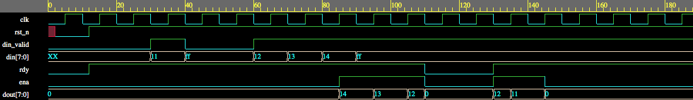

# CPEN 311 Fall 2020 Midterm 3

## Task 1: Using Ready, Enable and Memory

### Problem Description

Create a Verilog module named `reverse.sv` that accepts **EXACTLY** `N` 8-bit numbers, and then sends all them to a downstream module using the **READY/ENABLE** handshake.

The skeleton code defines `N` as a parameter with a default value of **4**. In our testbench, we may change this to any value between 1 and 1023.

On the INPUT side, your module should receive 8-bit data named `din[7:0]` and a valid signal `din_valid` that indicates when valid numbers are presented on the din bus. These numbers must be stored in a memory inside your module.

Internally, you **MUST** use a memory to remember the data. **DO NOT** use four separate registers.

On the OUTPUT side, after accepting 4 numbers on the input side, your module should transmit the same 4 numbers IN **REVERSE** ORDER. However, instead of sending results every clock cycle, you must follow a **READY/ENABLE** handshake with the downstream module. For every clock cycle the downstream module is able to receive a number, it will assert `READY` = 1 prior to the clock edge. Your module must assert `ENABLE` = 1 for the clock edge where the output is presented on `dout[7:0]`. The full handshake is not described here -- you should consult your lab documentation for any further issues.

After transmitting 4 numbers, your module should enter a `DONE` state and stop operating.

We have provided a sample testbench, `tb_rtl_reverse.sv`. You may modify this file, but it will not be marked.

A sample timing waveform is shown below. Note that the arrival of input data may be stalled by deasserting `DIN_VALID`. Also, the downstream module may stall your ability to send output data by deasserting `READY`.

### Milestones

1. Ensure that, after `reset`, the output `ENA` = 0. When no input is provided (`DIN_VALID` remains de-asserted, then `ENA` = 0 should be maintained (even if `READY` = 1).

2. As long as `READY` = 0, you must maintain `ENA` = 0 even after receiving four words on `DIN`. (That is, do not try to send any data if the downstream module is not ready to accept them.)

3. On the first three clock edges while `DIN_VALID` = 1, you must maintain `ENA` = 0, even if `READY` = 1. That is, do not attempt to send data until the system is presented with the fourth word or later.

4. After four clock edges where `DIN_VALID` = 1, you must output `ENA` = 0 at all times except when `READY` = 1. After that, on any clock edge after the downstream module asserts `READY` (`READY` = 1), you are allowed to assert `ENA` (`ENA` = 1) but only **exactly** four times. We will not check the data values, we will only verify that you assert `ENA` four times. During this time, we will not de-assert `READY`, but keep it at 1.

5. Like milestone 4, but now we may de-assert `READY` on some clock cycles. You must assert `ENA` only four times, and only on clock cycles where `READY` is asserted. After four times, `ENA` must remain deasserted at all times, even if `READY` = 1.

6. Like milestone 5, but now, on the first clock cycle where you assert `ENA`, you must also transmit `DOUT[7:0]` with the last valid data item received on `DIN[7:0]`. Future `DOUT[7:0]` values do not need to be correct.

7. Like milestone 6, but now the last two valid data items must be transmitted on `DOUT[7:0]` when `ENA`is asserted, in **reverse** order.

8. Like milestone 7, but now all 4 valid items must be transmitted in **reverse** order.

9. Like milestone 8, but it must work for any value of `N` between 1 and 1023.

10. Like milestone 9, but you must optimize your FSM so that `ENA`` is asserted in the same cycle that `READY` is received. This allows all four words to be transmitted immediately on every cycle the downstream module can accept it. However, the transition of your FSM between RECEIVE and TRANSMIT may delay the ability to transmit the very first word by a cycle or two.

11. BONUS: Optimize your FSM so it can transmit the last word received in the next clock edge. The sample timing diagram does this at time 85, where the data item 0x14.

12. BONUS: Optimize your FSM so it can transmit the last word received on the same clock edge.
